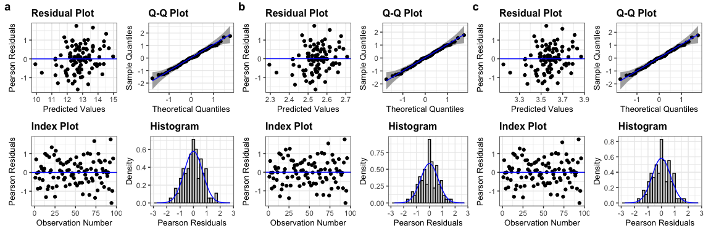
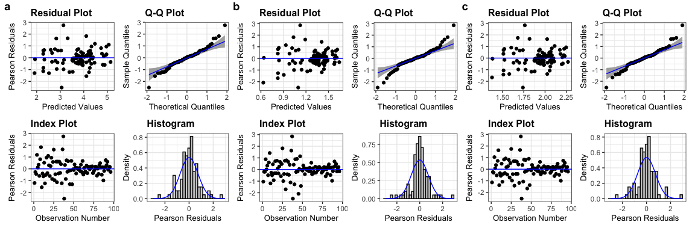
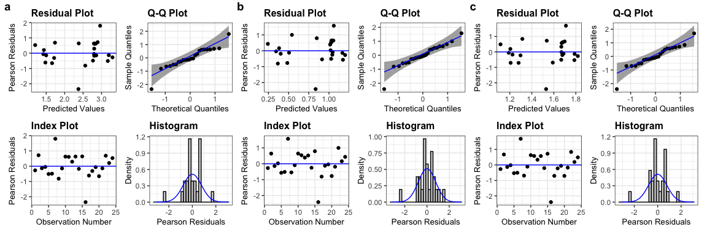
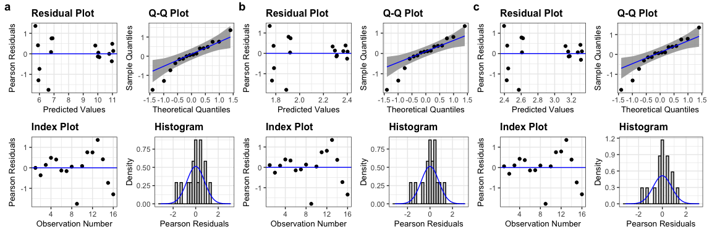

 


``` r
names(corn)
```

```
##  [1] "Plot"                          "Crop_ID"                      
##  [3] "Corn_weed_management"          "Harvested Weight (lbs.)"      
##  [5] "% Moisture"                    "Harvest strip length (ft)"    
##  [7] "Harvest strip width (ft)"      "Harvest strip area (acres)"   
##  [9] "Harvest strip area (hectares)" "Yield (lb/acre @ 0%)"         
## [11] "Yield (lb/acre @ 15.5%)"       "bu/acre at 15.5% moisture"    
## [13] "Mg/ha at 15.5% moisture"       "Year"                         
## [15] "Crop"                          "ton/ac at 15.5% moisture"     
## [17] "Mg/ha at 0% moisture"          "ton/ac at 0% moisture"        
## [19] "Block"
```

``` r
names(soy)
```

```
##  [1] "Plot"                          "Crop_ID"                      
##  [3] "Corn_weed_management"          "Harvested Weight (lbs.)"      
##  [5] "% Moisture"                    "Harvest strip length (ft)"    
##  [7] "Harvest strip width (ft)"      "Harvest strip area (acres)"   
##  [9] "Harvest strip area (hectares)" "Yield (lb/acre @ 0%)"         
## [11] "Yield (lb/acre @ 13%)"         "bu/acre at 13% moisture"      
## [13] "Mg/ha at 13% moisture"         "Year"                         
## [15] "Crop"                          "ton/ac at 13% moisture"       
## [17] "Mg/ha at 0% moisture"          "ton/ac at 0% moisture"        
## [19] "Block"
```

``` r
names(oat)
```

```
## [1] "Plot"                   "Crop_ID"                "Year"                  
## [4] "bu/ac at 14% moisture"  "ton/ac at 14% moisture" "Mg/ha at 14% moisture" 
## [7] "ton/ac at 0% moisture"  "Mg/ha at 0% moisture"   "Block"
```

``` r
names(alfalfa)
```

```
##  [1] "Block"                  "Bale wts (lb)"          "Fresh wt  (lb/acre)"   
##  [4] "Fresh wt (ton/acre)"    "fresh weight (g)"       "dry weight (g)"        
##  [7] "% moisture"             "Year"                   "Crop_ID"               
## [10] "Crop"                   "Harvested area (m2)"    "Harvested area (acre)" 
## [13] "ton/ac at 0% moisture"  "ton/ac at 15% moisture" "Mg/ha at 0% moisture"  
## [16] "Mg/ha at 15% moisture"
```
### Yield models 

#### Corn


#### Corn diagnosis: `corn.lmer` and `corn.lmer.ln` similar


``` r
list(corn.lmer, corn.lmer.ln, corn.lmer.s) %>%
  lapply(resid_panel,  qqbands = TRUE , nrow = 2) %>%
                              wrap_plots() +
                              plot_annotation(tag_levels = "a")
```

<div class="figure">

<p class="caption">(\#fig:unnamed-chunk-5)Model diagnosis for Marsden corn yield. Model fitting does not differ between original vs. transform.</p>
</div>

#### Soy


``` r
soy.lmer <- lmer(`Mg/ha at 13% moisture` ~ Block +  Crop_ID*Corn_weed_management + 
                    (1|Year) + 
                    (1|Year:Block) + 
                    (1|Year:Crop_ID) +
                    (1|Year:Corn_weed_management) + 
                    (1|Year:Crop_ID:Corn_weed_management)  +
                    (1|Block:Year:Crop_ID),
  data=soy)

soy.lmer.ln <- lmer(log(`Mg/ha at 13% moisture`) ~ Block +  Crop_ID*Corn_weed_management + 
                    (1|Year) + 
                    (1|Year:Block) + 
                    (1|Year:Crop_ID) +
                    (1|Year:Corn_weed_management) + 
                    (1|Year:Crop_ID:Corn_weed_management)  +
                    (1|Block:Year:Crop_ID),
  data=soy)

soy.lmer.s <- lmer(sqrt(`Mg/ha at 13% moisture`) ~ Block +  Crop_ID*Corn_weed_management + 
                    (1|Year) + 
                    (1|Year:Block) + 
                    (1|Year:Crop_ID) +
                    (1|Year:Corn_weed_management) + 
                    (1|Year:Crop_ID:Corn_weed_management)  +
                    (1|Block:Year:Crop_ID),
  data=soy)
```


#### Soybean diagnosis: `soy.lmer` and `soy.lmer.ln` similar


``` r
list(soy.lmer, soy.lmer.ln, soy.lmer.s) %>%
  lapply(resid_panel,  qqbands = TRUE , nrow = 2) %>%
                              wrap_plots() +
                              plot_annotation(tag_levels = "a")
```

<div class="figure">

<p class="caption">(\#fig:unnamed-chunk-7)Model diagnosis for Marsden soybean yield. Model fitting does not differ between original vs. transform.</p>
</div>

#### Oat


``` r
oat.lmer <- lmer(`Mg/ha at 14% moisture` ~ Block + 
                   Crop_ID + 
                   (1|Year) +
                   (1|Year:Block) +  
                   (1|Year:Crop_ID), 
#                  (1|Block:Year:Crop_ID), # removed because of over-fitting
  data=oat)


oat.lmer.ln <- lmer(log(`Mg/ha at 14% moisture`) ~ Block + 
                   Crop_ID + 
                   (1|Year) +
                   (1|Year:Block) +  
                   (1|Year:Crop_ID), 
  data=oat)

oat.lmer.s <- lmer(sqrt(`Mg/ha at 14% moisture`) ~ Block + 
                   Crop_ID + 
                   (1|Year) +
                   (1|Year:Block) +  
                   (1|Year:Crop_ID), 
  data=oat)
```


#### Oat diagnosis: `oat.lmer` and `oat.lmer.ln` similar


``` r
list(oat.lmer, oat.lmer.ln, oat.lmer.s) %>%
  lapply(resid_panel,  qqbands = TRUE , nrow = 2) %>%
                              wrap_plots() +
                              plot_annotation(tag_levels = "a")
```

<div class="figure">

<p class="caption">(\#fig:unnamed-chunk-9)Model diagnosis for Marsden oat yield. Model fitting does not differ between original vs. transform.</p>
</div>

#### Alfalfa


``` r
table(alfalfa$Crop_ID, alfalfa$Year)
```

```
##     
##      2017 2018 2019 2020
##   A4   16   12   12   12
```


``` r
## summing all the cuts within one year 
alf_sum <- alfalfa %>%
  group_by(Year, Block, Crop_ID) %>%
  summarize(Yield.Mg.ha = sum(`Mg/ha at 15% moisture`)) 
```


``` r
table(alf_sum$Crop_ID, alf_sum$Year)
```

```
##     
##      2017 2018 2019 2020
##   A4    4    4    4    4
```


``` r
alf.lmer <- lmer(Yield.Mg.ha ~ Block + (1|Year),
  data=alf_sum)

alf.lmer.ln <- lmer(log(Yield.Mg.ha) ~ Block + (1|Year) ,
  data=alf_sum)

alf.lmer.s <- lmer(sqrt(Yield.Mg.ha) ~ Block + (1|Year),
  data=alf_sum)
```

#### Alfalfa diagnosis: `alf.lmer` and `alf.lmer.ln` similar


``` r
list(alf.lmer, alf.lmer.ln, alf.lmer.s) %>%
  lapply(resid_panel,  qqbands = TRUE , nrow = 2) %>%
                              wrap_plots() +
                              plot_annotation(tag_levels = "a")
```

<div class="figure">

<p class="caption">(\#fig:unnamed-chunk-14)Model diagnosis for Marsden alfalfa hay yield. Model fitting does not differ between original vs. transform.</p>
</div>


### How did rotation system and corn weed management affect crop yields? {-}   

Results of the experiment indicated that crop diversification and reduced use of herbicides were not associated with lower crop yields (Table \@ref(tab:crop-jt-ct)). Averaged over four years, soybean was the only crop whose yield was affected by rotation (p = 0.0191, Table \@ref(tab:crop-jt-ct)). Soybean yield was 16% higher in the 4-year rotation than in the 2-year rotation (p = 0.0181). Crop yields in the experiment were as high or higher than the averages for the state of Iowa and Boone County (Figure \@ref(fig:crop-bar)). 

<table style="NAborder-bottom: 0;">
<caption>(\#tab:crop-jt-ct)Contrasts of rotation effect (expressed by Crop ID) on crop yields. The abbreviations on the contrast column are crop identities, which are the combinations of the first letter in crop species names and the rotation in which it occurred.</caption>
 <thead>
<tr>
<th style="border-bottom:hidden;padding-bottom:0; padding-left:3px;padding-right:3px;text-align: center; " colspan="5"><div style="border-bottom: 1px solid #ddd; padding-bottom: 5px; ">ANOVA</div></th>
<th style="border-bottom:hidden;padding-bottom:0; padding-left:3px;padding-right:3px;text-align: center; " colspan="3"><div style="border-bottom: 1px solid #ddd; padding-bottom: 5px; ">Comparison</div></th>
</tr>
  <tr>
   <th style="text-align:left;"> Source of variation </th>
   <th style="text-align:right;"> df1 </th>
   <th style="text-align:right;"> df2 </th>
   <th style="text-align:right;"> F </th>
   <th style="text-align:right;"> p </th>
   <th style="text-align:left;"> contrast </th>
   <th style="text-align:right;"> ratio </th>
   <th style="text-align:right;"> p </th>
  </tr>
 </thead>
<tbody>
  <tr grouplength="3"><td colspan="8" style="border-bottom: 1px solid;"><strong>(A) - Corn</strong></td></tr>
<tr>
   <td style="text-align:left;padding-left: 2em;" indentlevel="1"> Crop ID </td>
   <td style="text-align:right;"> 2 </td>
   <td style="text-align:right;"> 6 </td>
   <td style="text-align:right;"> 3.19 </td>
   <td style="text-align:right;border-right:1px solid;"> 0.1138 </td>
   <td style="text-align:left;"> C2 / C3 </td>
   <td style="text-align:right;"> 0.938 </td>
   <td style="text-align:right;"> 0.1882 </td>
  </tr>
  <tr>
   <td style="text-align:left;padding-left: 2em;" indentlevel="1"> Corn weed management </td>
   <td style="text-align:right;"> 1 </td>
   <td style="text-align:right;"> 3 </td>
   <td style="text-align:right;"> 0.32 </td>
   <td style="text-align:right;border-right:1px solid;"> 0.6088 </td>
   <td style="text-align:left;"> C2 / C4 </td>
   <td style="text-align:right;"> 0.929 </td>
   <td style="text-align:right;"> 0.1278 </td>
  </tr>
  <tr>
   <td style="text-align:left;padding-left: 2em;" indentlevel="1"> Crop ID x Corn weed management </td>
   <td style="text-align:right;"> 2 </td>
   <td style="text-align:right;"> 6 </td>
   <td style="text-align:right;"> 2.20 </td>
   <td style="text-align:right;border-right:1px solid;"> 0.1914 </td>
   <td style="text-align:left;"> C3 / C4 </td>
   <td style="text-align:right;"> 0.990 </td>
   <td style="text-align:right;"> 0.9507 </td>
  </tr>
  <tr grouplength="3"><td colspan="8" style="border-bottom: 1px solid;"><strong>(B) - Soybean</strong></td></tr>
<tr>
   <td style="text-align:left;padding-left: 2em;" indentlevel="1"> Crop ID </td>
   <td style="text-align:right;"> 2 </td>
   <td style="text-align:right;"> 6 </td>
   <td style="text-align:right;"> 8.22 </td>
   <td style="text-align:right;border-right:1px solid;"> 0.0191 </td>
   <td style="text-align:left;"> S2 / S3 </td>
   <td style="text-align:right;"> 0.959 </td>
   <td style="text-align:right;"> 0.5499 </td>
  </tr>
  <tr>
   <td style="text-align:left;padding-left: 2em;" indentlevel="1"> Corn weed management </td>
   <td style="text-align:right;"> 1 </td>
   <td style="text-align:right;"> 3 </td>
   <td style="text-align:right;"> 0.18 </td>
   <td style="text-align:right;border-right:1px solid;"> 0.7018 </td>
   <td style="text-align:left;"> S2 / S4 </td>
   <td style="text-align:right;"> 0.862 </td>
   <td style="text-align:right;"> 0.0181 </td>
  </tr>
  <tr>
   <td style="text-align:left;padding-left: 2em;" indentlevel="1"> Crop ID x Corn weed management </td>
   <td style="text-align:right;"> 2 </td>
   <td style="text-align:right;"> 6 </td>
   <td style="text-align:right;"> 0.62 </td>
   <td style="text-align:right;border-right:1px solid;"> 0.5678 </td>
   <td style="text-align:left;"> S3 / S4 </td>
   <td style="text-align:right;"> 0.898 </td>
   <td style="text-align:right;"> 0.0670 </td>
  </tr>
  <tr grouplength="1"><td colspan="8" style="border-bottom: 1px solid;"><strong>(C) - Oat</strong></td></tr>
<tr>
   <td style="text-align:left;padding-left: 2em;" indentlevel="1"> Crop ID </td>
   <td style="text-align:right;"> 1 </td>
   <td style="text-align:right;"> 2 </td>
   <td style="text-align:right;"> 1.37 </td>
   <td style="text-align:right;border-right:1px solid;"> 0.3621 </td>
   <td style="text-align:left;"> O3 / O4 </td>
   <td style="text-align:right;"> 0.914 </td>
   <td style="text-align:right;"> 0.3621 </td>
  </tr>
</tbody>
<tfoot><tr><td style="padding: 0; " colspan="100%">
<span style="font-style: italic;">Note: </span> <sup></sup> Corn weed management: low herbicide or conventional. Crop ID: crop species and the cropping system in which it occurred: C2 - corn in the 2-year rotation, C3 - corn in the 3-year rotation, C4 - corn in the 4-year rotation, S2 - soybean in the 2-year rotation, S3 - soybean in the 3-year rotation, S4 - soybean in the 4-year rotation, O3 - oat in the 3-year rotation, and O4 - oat in the 4-year rotation.</td></tr></tfoot>
</table>


 

```
## # A tibble: 4 × 3
##   Commodity IA_avg_Mg IA_sd_Mg
##   <chr>         <dbl>    <dbl>
## 1 corn          11.9     1.30 
## 2 hay            8.05    1.41 
## 3 oats           2.57    0.556
## 4 soybeans       3.70    0.321
```


```
## # A tibble: 4 × 3
##   Commodity Boone_avg_Mg Boone_sd_Mg
##   <chr>            <dbl>       <dbl>
## 1 corn             11.6        1.04 
## 2 hay               7.51      NA    
## 3 oats              3.28       1.06 
## 4 soybeans          3.62       0.164
```


<div class="figure">

<p class="caption">(\#fig:crop-bar)Mean crop yields by rotation from 2017 to 2020. The color-coded bars show crop yields (Mg ha$^-1$) in the experiment plots. The error bars show the 95% confidence intervals. The solid horizontal lines show mean yields for Iowa and dashed lines show mean yields for Boone County. Corn, soybean, and alfalfa yields in the experiment were averaged over four years, oat grain yields in the experiment were averaged over 2017, 2019, and 2020 because in 2018 oat was harvested for hay. Because county-specific alfalfa hay yields in 2019 and 2020 were unavailable at this writing, Boone County alfalfa yield (solid line) was averaged over 2017 and 2018 and Iowa hay yield was averaged over all counties in 2017 and 2018 and Iowa hay yield (dashed line) was averaged from all county-based values in 2017 and 2018 and two state-based values in 2019 and 2020.</p>
</div>


