```r
dens_1720_clean %>%
  group_by(Corn_weed_management, Crop_ID, Year) %>%
  summarise(meanP_pl = mean(AMATA)) %>%
  filter(Year %in% c("2018", "2019"), Corn_weed_management == "conv")
```

```
## # A tibble: 18 × 4
## # Groups:   Corn_weed_management, Crop_ID [9]
##    Corn_weed_management Crop_ID Year  meanP_pl
##    <fct>                <fct>   <fct>    <dbl>
##  1 conv                 C2      2018    0.337 
##  2 conv                 C2      2019    5.02  
##  3 conv                 S2      2018    0.661 
##  4 conv                 S2      2019    0.148 
##  5 conv                 C3      2018    0.0270
##  6 conv                 C3      2019    3.01  
##  7 conv                 S3      2018    0.621 
##  8 conv                 S3      2019    0     
##  9 conv                 O3      2018   24.4   
## 10 conv                 O3      2019   23.0   
## 11 conv                 C4      2018    0.0135
## 12 conv                 C4      2019    0.781 
## 13 conv                 S4      2018    0.445 
## 14 conv                 S4      2019    0     
## 15 conv                 O4      2018    8.62  
## 16 conv                 O4      2019  109.    
## 17 conv                 A4      2018    2     
## 18 conv                 A4      2019   14.3
```


#### How did rotation, crop species, and corn weed management affect individual weed species abundance?{-}  

*The hypothesis that "including oat and alfalfa in rotations with corn and soybean will reduce the density and aboveground mass of noxious weed species in corn and soybean" was partially supported.* Crop identity affected individual density of seven most abundant weed species but corn weed management affected that of two weed species only, i.e., DIGSA and SETFA (p = 0.0189 and p = 0.0196, resepectively; Table \@ref(tab:ind-dens-biom-jt). Among those seven weed species, the aboveground mass of four (CHEAL, DIGSA, SETFA, and TAROF) were affected by crop identity, but none was affected by corn weed management (Table \@ref(tab:ind-dens-biom-jt). The magnitude of difference in stand density and aboveground mass were the most pronounced between crop types (Table \@ref(tab:indiv-dens-biom-ct)). The main-plot effects concerning crop identity on individual species responses are elaborated below.  


<table class="table" style="color: black; margin-left: auto; margin-right: auto;border-bottom: 0;">
<caption>(\#tab:ind-dens-biom-jt)Treatment effects on the stand density and aboveground mass of the seven most abundant weed species, listed alphabetically. All the other weeds species were grouped into OTHERS.</caption>
 <thead>
<tr>
<th style="empty-cells: hide;border-bottom:hidden;" colspan="3"></th>
<th style="border-bottom:hidden;padding-bottom:0; padding-left:3px;padding-right:3px;text-align: center; " colspan="2"><div style="border-bottom: 1px solid #ddd; padding-bottom: 5px; ">Stand density</div></th>
<th style="border-bottom:hidden;padding-bottom:0; padding-left:3px;padding-right:3px;text-align: center; " colspan="2"><div style="border-bottom: 1px solid #ddd; padding-bottom: 5px; ">Aboveground mass</div></th>
</tr>
  <tr>
   <th style="text-align:left;"> Source of variation </th>
   <th style="text-align:right;"> df1 </th>
   <th style="text-align:right;"> df2 </th>
   <th style="text-align:right;"> F </th>
   <th style="text-align:right;"> p </th>
   <th style="text-align:right;"> F </th>
   <th style="text-align:right;"> p </th>
  </tr>
 </thead>
<tbody>
  <tr grouplength="3"><td colspan="7" style="border-bottom: 1px solid;"><strong>(A) - AMATA</strong></td></tr>
<tr>
   <td style="text-align:left;padding-left: 2em;" indentlevel="1"> Crop ID </td>
   <td style="text-align:right;"> 8 </td>
   <td style="text-align:right;"> 24 </td>
   <td style="text-align:right;"> 3.72 </td>
   <td style="text-align:right;border-right:1px solid;"> 0.0058 </td>
   <td style="text-align:right;"> 1.52 </td>
   <td style="text-align:right;"> 0.2016 </td>
  </tr>
  <tr>
   <td style="text-align:left;padding-left: 2em;" indentlevel="1"> Corn weed management </td>
   <td style="text-align:right;"> 1 </td>
   <td style="text-align:right;"> 3 </td>
   <td style="text-align:right;"> 0.73 </td>
   <td style="text-align:right;border-right:1px solid;"> 0.4566 </td>
   <td style="text-align:right;"> 4.19 </td>
   <td style="text-align:right;"> 0.1333 </td>
  </tr>
  <tr>
   <td style="text-align:left;padding-left: 2em;" indentlevel="1"> Crop ID x Corn weed management </td>
   <td style="text-align:right;"> 8 </td>
   <td style="text-align:right;"> 24 </td>
   <td style="text-align:right;"> 0.96 </td>
   <td style="text-align:right;border-right:1px solid;"> 0.4886 </td>
   <td style="text-align:right;"> 1.09 </td>
   <td style="text-align:right;"> 0.4052 </td>
  </tr>
  <tr grouplength="3"><td colspan="7" style="border-bottom: 1px solid;"><strong>(B) - CHEAL</strong></td></tr>
<tr>
   <td style="text-align:left;padding-left: 2em;" indentlevel="1"> Crop ID </td>
   <td style="text-align:right;"> 8 </td>
   <td style="text-align:right;"> 24 </td>
   <td style="text-align:right;"> 22.06 </td>
   <td style="text-align:right;border-right:1px solid;"> &lt;.0001 </td>
   <td style="text-align:right;"> 15.53 </td>
   <td style="text-align:right;"> &lt;.0001 </td>
  </tr>
  <tr>
   <td style="text-align:left;padding-left: 2em;" indentlevel="1"> Corn weed management </td>
   <td style="text-align:right;"> 1 </td>
   <td style="text-align:right;"> 3 </td>
   <td style="text-align:right;"> 2.10 </td>
   <td style="text-align:right;border-right:1px solid;"> 0.2430 </td>
   <td style="text-align:right;"> 0.56 </td>
   <td style="text-align:right;"> 0.5097 </td>
  </tr>
  <tr>
   <td style="text-align:left;padding-left: 2em;" indentlevel="1"> Crop ID x Corn weed management </td>
   <td style="text-align:right;"> 8 </td>
   <td style="text-align:right;"> 24 </td>
   <td style="text-align:right;"> 1.59 </td>
   <td style="text-align:right;border-right:1px solid;"> 0.1808 </td>
   <td style="text-align:right;"> 1.07 </td>
   <td style="text-align:right;"> 0.4180 </td>
  </tr>
  <tr grouplength="3"><td colspan="7" style="border-bottom: 1px solid;"><strong>(C) - DIGSA</strong></td></tr>
<tr>
   <td style="text-align:left;padding-left: 2em;" indentlevel="1"> Crop ID </td>
   <td style="text-align:right;"> 8 </td>
   <td style="text-align:right;"> 24 </td>
   <td style="text-align:right;"> 15.52 </td>
   <td style="text-align:right;border-right:1px solid;"> &lt;.0001 </td>
   <td style="text-align:right;"> 8.14 </td>
   <td style="text-align:right;"> &lt;.0001 </td>
  </tr>
  <tr>
   <td style="text-align:left;padding-left: 2em;" indentlevel="1"> Corn weed management </td>
   <td style="text-align:right;"> 1 </td>
   <td style="text-align:right;"> 3 </td>
   <td style="text-align:right;"> 20.86 </td>
   <td style="text-align:right;border-right:1px solid;"> 0.0197 </td>
   <td style="text-align:right;"> 16.44 </td>
   <td style="text-align:right;"> 0.0270 </td>
  </tr>
  <tr>
   <td style="text-align:left;padding-left: 2em;" indentlevel="1"> Crop ID x Corn weed management </td>
   <td style="text-align:right;"> 8 </td>
   <td style="text-align:right;"> 24 </td>
   <td style="text-align:right;"> 1.22 </td>
   <td style="text-align:right;border-right:1px solid;"> 0.3321 </td>
   <td style="text-align:right;"> 0.78 </td>
   <td style="text-align:right;"> 0.6237 </td>
  </tr>
  <tr grouplength="3"><td colspan="7" style="border-bottom: 1px solid;"><strong>(D) - ECHCG</strong></td></tr>
<tr>
   <td style="text-align:left;padding-left: 2em;" indentlevel="1"> Crop ID </td>
   <td style="text-align:right;"> 8 </td>
   <td style="text-align:right;"> 24 </td>
   <td style="text-align:right;"> 2.61 </td>
   <td style="text-align:right;border-right:1px solid;"> 0.0328 </td>
   <td style="text-align:right;"> 2.20 </td>
   <td style="text-align:right;"> 0.0645 </td>
  </tr>
  <tr>
   <td style="text-align:left;padding-left: 2em;" indentlevel="1"> Corn weed management </td>
   <td style="text-align:right;"> 1 </td>
   <td style="text-align:right;"> 3 </td>
   <td style="text-align:right;"> 5.80 </td>
   <td style="text-align:right;border-right:1px solid;"> 0.0952 </td>
   <td style="text-align:right;"> 4.84 </td>
   <td style="text-align:right;"> 0.1150 </td>
  </tr>
  <tr>
   <td style="text-align:left;padding-left: 2em;" indentlevel="1"> Crop ID x Corn weed management </td>
   <td style="text-align:right;"> 8 </td>
   <td style="text-align:right;"> 24 </td>
   <td style="text-align:right;"> 1.16 </td>
   <td style="text-align:right;border-right:1px solid;"> 0.3615 </td>
   <td style="text-align:right;"> 1.04 </td>
   <td style="text-align:right;"> 0.4348 </td>
  </tr>
  <tr grouplength="3"><td colspan="7" style="border-bottom: 1px solid;"><strong>(E) - SETFA</strong></td></tr>
<tr>
   <td style="text-align:left;padding-left: 2em;" indentlevel="1"> Crop ID </td>
   <td style="text-align:right;"> 8 </td>
   <td style="text-align:right;"> 24 </td>
   <td style="text-align:right;"> 8.78 </td>
   <td style="text-align:right;border-right:1px solid;"> &lt;.0001 </td>
   <td style="text-align:right;"> 4.22 </td>
   <td style="text-align:right;"> 0.0028 </td>
  </tr>
  <tr>
   <td style="text-align:left;padding-left: 2em;" indentlevel="1"> Corn weed management </td>
   <td style="text-align:right;"> 1 </td>
   <td style="text-align:right;"> 3 </td>
   <td style="text-align:right;"> 20.91 </td>
   <td style="text-align:right;border-right:1px solid;"> 0.0196 </td>
   <td style="text-align:right;"> 13.96 </td>
   <td style="text-align:right;"> 0.0334 </td>
  </tr>
  <tr>
   <td style="text-align:left;padding-left: 2em;" indentlevel="1"> Crop ID x Corn weed management </td>
   <td style="text-align:right;"> 8 </td>
   <td style="text-align:right;"> 24 </td>
   <td style="text-align:right;"> 0.70 </td>
   <td style="text-align:right;border-right:1px solid;"> 0.6892 </td>
   <td style="text-align:right;"> 1.04 </td>
   <td style="text-align:right;"> 0.4371 </td>
  </tr>
  <tr grouplength="3"><td colspan="7" style="border-bottom: 1px solid;"><strong>(F) - SETLU</strong></td></tr>
<tr>
   <td style="text-align:left;padding-left: 2em;" indentlevel="1"> Crop ID </td>
   <td style="text-align:right;"> 8 </td>
   <td style="text-align:right;"> 24 </td>
   <td style="text-align:right;"> 3.09 </td>
   <td style="text-align:right;border-right:1px solid;"> 0.0154 </td>
   <td style="text-align:right;"> 1.33 </td>
   <td style="text-align:right;"> 0.2774 </td>
  </tr>
  <tr>
   <td style="text-align:left;padding-left: 2em;" indentlevel="1"> Corn weed management </td>
   <td style="text-align:right;"> 1 </td>
   <td style="text-align:right;"> 3 </td>
   <td style="text-align:right;"> 4.44 </td>
   <td style="text-align:right;border-right:1px solid;"> 0.1257 </td>
   <td style="text-align:right;"> 3.28 </td>
   <td style="text-align:right;"> 0.1681 </td>
  </tr>
  <tr>
   <td style="text-align:left;padding-left: 2em;" indentlevel="1"> Crop ID x Corn weed management </td>
   <td style="text-align:right;"> 8 </td>
   <td style="text-align:right;"> 24 </td>
   <td style="text-align:right;"> 1.11 </td>
   <td style="text-align:right;border-right:1px solid;"> 0.3930 </td>
   <td style="text-align:right;"> 0.83 </td>
   <td style="text-align:right;"> 0.5875 </td>
  </tr>
  <tr grouplength="3"><td colspan="7" style="border-bottom: 1px solid;"><strong>(G) - TAROF</strong></td></tr>
<tr>
   <td style="text-align:left;padding-left: 2em;" indentlevel="1"> Crop ID </td>
   <td style="text-align:right;"> 8 </td>
   <td style="text-align:right;"> 24 </td>
   <td style="text-align:right;"> 49.63 </td>
   <td style="text-align:right;border-right:1px solid;"> &lt;.0001 </td>
   <td style="text-align:right;"> 35.81 </td>
   <td style="text-align:right;"> &lt;.0001 </td>
  </tr>
  <tr>
   <td style="text-align:left;padding-left: 2em;" indentlevel="1"> Corn weed management </td>
   <td style="text-align:right;"> 1 </td>
   <td style="text-align:right;"> 3 </td>
   <td style="text-align:right;"> 0.61 </td>
   <td style="text-align:right;border-right:1px solid;"> 0.4914 </td>
   <td style="text-align:right;"> 0.33 </td>
   <td style="text-align:right;"> 0.6067 </td>
  </tr>
  <tr>
   <td style="text-align:left;padding-left: 2em;" indentlevel="1"> Crop ID x Corn weed management </td>
   <td style="text-align:right;"> 8 </td>
   <td style="text-align:right;"> 24 </td>
   <td style="text-align:right;"> 0.74 </td>
   <td style="text-align:right;border-right:1px solid;"> 0.6553 </td>
   <td style="text-align:right;"> 1.20 </td>
   <td style="text-align:right;"> 0.3382 </td>
  </tr>
  <tr grouplength="3"><td colspan="7" style="border-bottom: 1px solid;"><strong>(H) - OTHERS</strong></td></tr>
<tr>
   <td style="text-align:left;padding-left: 2em;" indentlevel="1"> Crop ID </td>
   <td style="text-align:right;"> 8 </td>
   <td style="text-align:right;"> 24 </td>
   <td style="text-align:right;"> 4.76 </td>
   <td style="text-align:right;border-right:1px solid;"> 0.0014 </td>
   <td style="text-align:right;"> 2.35 </td>
   <td style="text-align:right;"> 0.0503 </td>
  </tr>
  <tr>
   <td style="text-align:left;padding-left: 2em;" indentlevel="1"> Corn weed management </td>
   <td style="text-align:right;"> 1 </td>
   <td style="text-align:right;"> 3 </td>
   <td style="text-align:right;"> 1.99 </td>
   <td style="text-align:right;border-right:1px solid;"> 0.2533 </td>
   <td style="text-align:right;"> 2.27 </td>
   <td style="text-align:right;"> 0.2288 </td>
  </tr>
  <tr>
   <td style="text-align:left;padding-left: 2em;" indentlevel="1"> Crop ID x Corn weed management </td>
   <td style="text-align:right;"> 8 </td>
   <td style="text-align:right;"> 24 </td>
   <td style="text-align:right;"> 0.07 </td>
   <td style="text-align:right;border-right:1px solid;"> 0.9997 </td>
   <td style="text-align:right;"> 0.43 </td>
   <td style="text-align:right;"> 0.8939 </td>
  </tr>
</tbody>
<tfoot><tr><td style="padding: 0; " colspan="100%">
<span style="font-style: italic;">Note: </span> <sup></sup> Corn weed management: low herbicide or conventional. C2 - corn in the 2-year rotation, C3 - corn in the 3-year rotation, C4 - corn in the 4-year rotation, S2 - soybean in the 2-year rotation, S3 - soybean in the 3-year rotation, S4 - soybean in the 4-year rotation, O3 - oat in the 3-year rotation, O4 - oat in the 4-year rotation, and A4 - alfalfa in the 4-year rotation.</td></tr></tfoot>
</table>


```r
biom_result_t$means %>%
  map(~ broom::tidy(.x)) %>%
 bind_rows(.id = "spp") %>%
  select(1:5) 
```

```
## # A tibble: 144 × 5
##    spp   Crop_ID Corn_weed_management response std.error
##    <chr> <chr>   <chr>                   <dbl>     <dbl>
##  1 AMATA C2      conv                   0.357     0.547 
##  2 AMATA S2      conv                   0.886     1.36  
##  3 AMATA C3      conv                   0.0547    0.0844
##  4 AMATA S3      conv                   0.403     0.616 
##  5 AMATA O3      conv                   1.41      2.15  
##  6 AMATA C4      conv                   0.0203    0.0319
##  7 AMATA S4      conv                   0.0165    0.0260
##  8 AMATA O4      conv                   4.29      6.56  
##  9 AMATA A4      conv                   0.0658    0.101 
## 10 AMATA C2      low                    0.0985    0.151 
## # ℹ 134 more rows
```

*The cool-season crops were responsible for AMATA stand density differences, but those differences were not strong enough to be apparent between rotation averages.* AMATA stand density and aboveground mass were comparable among all rotation systems averaged over crop phases (p-values > 0.05), among rotations for the same crop species (p-values > 0.05), and within the same crop type across rotations (p-values > 0.05). Averaged over the same crop types (warm-season or cool-season), AMATA stand density in cool-season was 12.25-fold greater than that in warm-season crops (p = 0.0001), but AMATA aboveground mass was comparable in cool-season and warm-season crops (p = 0.0906). Within the same rotation, AMATA stand density was 11-fold (p = 0.0143) and 23-fold (p = 0.0003) greater in the cool-season than in the warm-season crops overall averages, but AMATA aboveground mass was comparable in these crop environments (p = 0.2355 and p = 0.0493, respectively).  


*The cool-season crops, especially oat were responsible for CHEAL stand density and aboveground mass differences between rotation averages.* CHEAL stand density and aboveground mass were 4-fold (p = 0.008) and 5-fold (p = 0.199) greater in the average of the 3-year and 4-year rotations than in the 2-year rotation, but comparable between the 3-year and 4-year rotations (p = 0.9195 and p = 0.6114, respectively). CHEAL stand density and aboveground mass were comparable between rotations for the same crop species (p-values > 0.05) and within the warm-season crops (p-values > 0.05). CHEAL stand density and aboveground mass were 38-fold (p < 0.0001) and 204-fold (p < 0.0001) greater in the cool-season crops than in the warm-season crops overall averages; 67-fold (p < 0.0001) and 571-fold (p < 0.0001) greater in the cool-season crop than in the warm-season crops average of the 3-year rotation; and 37-fold (p < 0.0001) and 232-fold (p < 0.0001) greater in the cool-season crop than in the warm-season crops average of the 4-year rotation. CHEAL stand density and aboveground mass were 11-fold (p = 0.0001) and 96-fold (p = 0.0001) greater in oat than in alfalfa. 


*The cool-season crops, especially alfalfa were responsible for DIGSA stand density and aboveground mass differences between rotation averages.* DIGSA stand density in the average of the 3-year and 4-year rotations was two-fold greater than in the 2-year rotation (p = 0.0072) and 5-fold greater in the 4-year rotation than in the 3-year rotation (p < 0.0001). DIGSA aboveground mass was comparable between the 2-year and the average of the 3-year and 4-year rotations (p = 0.1098), but 14-fold greater in the 4-year than in the 3-year rotations (p = 0.0001). DIGSA stand density and aboveground mass were comparable between rotations for the same crop species (p-values > 0.05), except for oat (p = 0.0062 and p = 0.0032). DIGSA stand density and aboveground mass were 10-fold and 27-fold greater in the cool-season crop averages than in the warm-season crops averages, 20-fold (p = 0.0001) and 103-fold (p = 0.0001) greater in the cool-season crops than in the warm-season crops of the 4-year rotation, but comparable between cool-season and warm-season crops of the 3-year rotation (p = 0.0603 and p = 0.3924, respectively). DIGSA stand density and aboveground mass were 14-fold (p = 0.0001) and 33-fold (p = 0.0001) greater in alfalfa than in oat.   


*ECHCG responses generally were similar to those of AMATA.* ECHCG stand density and aboveground mass were comparable between all rotation averages (p-values > 0.05), between rotations for the same crop species (p-values > 0.05), within the same crop type between rotations (p-values > 0.05), and within the 3-year rotation (p-values > 0.05). Averaged over the same crop types, ECHCG stand density and aboveground mass were 4-fold (p = 0.0003) and 10-fold (p = 0.0012) greater in the cool-season than in the warm-season crops. Within the 4-year rotation, ECHCG stand density and aboveground mass were 5-fold (p = 0.0014) and 18-fold (p = 0.0031) greater in the cool-season than in the warm-season crops.   


*The cool-season crops were responsible for SETFA stand density and aboveground mass differences, but those differences were not strong enough be apparent between rotation averages.* SETFA stand density and aboveground mass were comparable between all rotation averages (p-values > 0.05), between rotations for the same crop species (p-values > 0.05), within the warm-season crops between rotations (p-values > 0.05), and within the cool-season crops (p-values > 0.05). Averaged over the same crop types, SETFA stand density and aboveground mass were 10-fold (p < 0.0001) and 15-fold (p = 0.0008) greater in the cool-season than in the warm-season crops. Within the same rotation, SETFA stand density and aboveground mass were 11-fold to 23-fold greater in the cool-season than in the warm-season crops (Table \@ref(tab:indiv-dens-biom-ct)).  

SETLU stand density and aboveground mass were comparable in most pairs of comparison (p-values > 0.05), except that SETLU stand density was 2.5-fold greater in the cool-season crops average than in the warm-season crops average(p = 0.0404).  

*The cool-season crops, especially oat were responsible for TAROF stand density and aboveground mass differences between rotation averages.* TAROF stand density and aboveground mass in the 3-year and 4-year rotations average were 4-fold (p < 0.0001) and 14-fold (p < 0.0001) greater than those in the 2-year rotation. TAROF stand density and aboveground mass in the 3-year rotation were and 5-fold  (p < 0.0001) and 20-fold (p < 0.0001) greater than those in the 4-year rotation. TAROF stand density and aboveground mass were comparable among the warm-season crops between rotations and within the same crops between rotations (p-values > 0.05), except in oat (p < 0.0001). TAROF stand density and aboveground mass were 24-fold (p < 0.001) and 390-fold (p < 0.0001) greater in cool-season than in warm-season crop averages, 4-fold (p = 0.0001) and 20-fold (p = 0.0002) greater in oat than in corn and soybean averages in the 3-year rotation, and 54-fold (p < 0.0001) and 1483-fold (p < 0.0001) greater in the cool-season crops than in the warm-season crops in the 4-year rotation. TAROF stand density and aboveground mass were 6-fold (p < 0.0001) and 20-fold (p = 0.0001) greater in oat than in alfalfa.


##### Relative abundance of biomass 

```r
biom_1720_clean.raw <- biom_1720 %>% replace(is.na(.), 0)%>%
  mutate(SETSP = SETFA + SETLU) %>%
  dplyr::select( Crop_ID, Block, Year, Corn_weed_management, Total,
                AMATA , CHEAL , DIGSA , ECHCG , SETSP , TAROF) %>%
   mutate(
    AMATA_percent = (AMATA / Total) * 100,
    CHEAL_percent = (CHEAL / Total) * 100,
    DIGSA_percent = (DIGSA / Total) * 100,
    ECHCG_percent = (ECHCG / Total) * 100,
    SETSP_percent = (SETSP / Total) * 100,
    TAROF_percent = (TAROF / Total) * 100) %>%
    dplyr::select(Year, Block, 
                  Crop_ID, Corn_weed_management, 
                  AMATA_percent, CHEAL_percent, DIGSA_percent,
                  ECHCG_percent, SETSP_percent, TAROF_percent) 
```


```r
biom_1720_clean.raw_long <-  biom_1720_clean.raw %>%
  pivot_longer(!c(Year : Corn_weed_management),
               names_to = "Species",
               values_to =  "Relative.abundance")
```


```r
tran <- make.tran("asin.sqrt", 100)

indv_spp_result_t <- biom_1720_clean.raw_long %>%
  group_by(Species) %>% # to fit a linear model for each species
  nest() %>%
  mutate(models=map(data,~lmer(Relative.abundance ~ Block +
                                 Crop_ID*Corn_weed_management + 
                        (1|Year) + (1|Year:Block) + 
                       (1|Year:Crop_ID) + (1|Year:Corn_weed_management) + 
                       (1|Year:Crop_ID:Corn_weed_management)  + (1|Block:Year:Crop_ID),data =.x))) %>%
  mutate(models.t = map(data, ~with(tran, 
                                  lmer(linkfun(Relative.abundance) ~ Block +
                                         Crop_ID * Corn_weed_management + 
                                         (1|Year) + (1|Year:Block) + 
                                         (1|Year:Crop_ID) + (1|Year:Corn_weed_management) + 
                                         (1|Year:Crop_ID:Corn_weed_management) + (1|Block:Year:Crop_ID),
                                       data = .x)))) %>%
  ungroup %>%
  mutate(jts = map(models.t, joint_tests), #ANOVA table, with Block effect
         diag_plots = map(models, resid_panel),  #diagnosis plot
        diag_plots.t = map(models.t, resid_panel), 
    jt_cleans = map2(data, jts, ~print(.y, export = TRUE)$summary), #ANOVA table, with Block effect with clean format
         means = map2(data, models.t,~ emmeans(.y, ~ Crop_ID | Corn_weed_management,data=.x, type = "response")), #estimated mean density of each weed species in each crop ID, separated by corn weed management, for arrow_plot
        means2 = map2(data, models.t,~emmeans(.y,  c("Crop_ID","Corn_weed_management"),data=.x, type = "response")), # EM means, for ANOVA table, averaged over block
    jts2 = map(means2, joint_tests), #ANOVA table, averaged over block 
    jts2_clean = map2(data, jts2, ~print(.y, export = TRUE)$summary), #ANOVA table, averaged over block in clean format
across(models:jts2_clean, setNames,  .$Species))
```
Arsine squareroot improved model fitting.  


```r
indv_spp_result_t$diag_plots
```

```
## $AMATA_percent
```

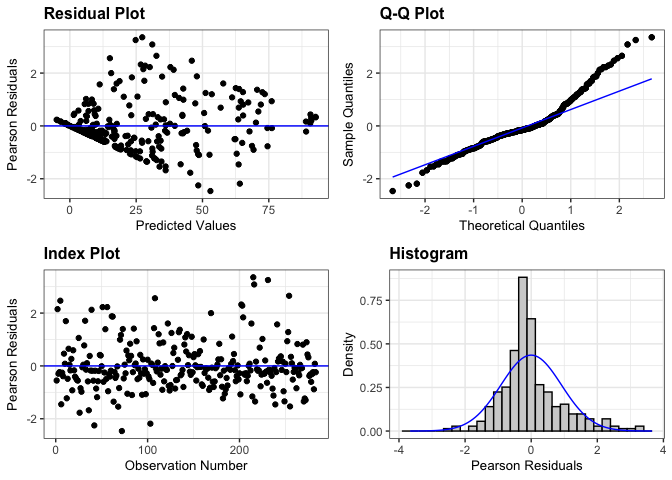<!-- -->

```
## 
## $CHEAL_percent
```

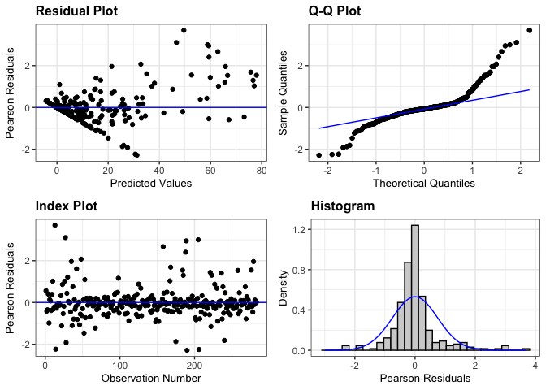<!-- -->

```
## 
## $DIGSA_percent
```

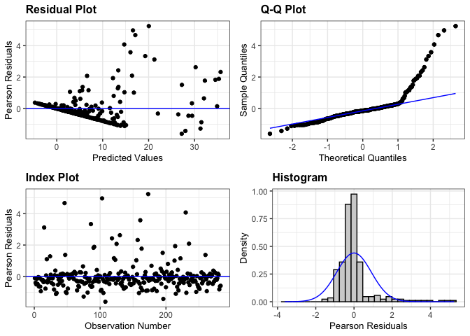<!-- -->

```
## 
## $ECHCG_percent
```

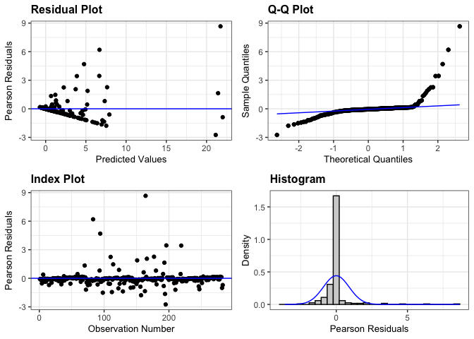<!-- -->

```
## 
## $SETSP_percent
```

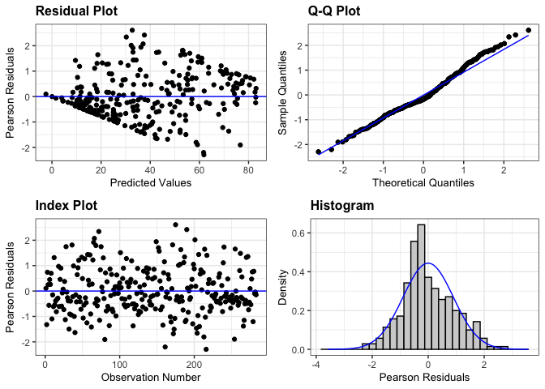<!-- -->

```
## 
## $TAROF_percent
```

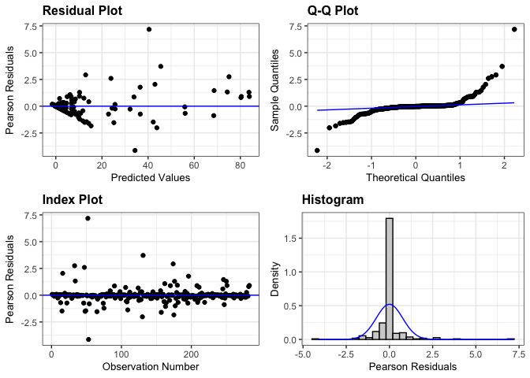<!-- -->


```r
indv_spp_result_t$diag_plots.t
```

```
## $AMATA_percent
```

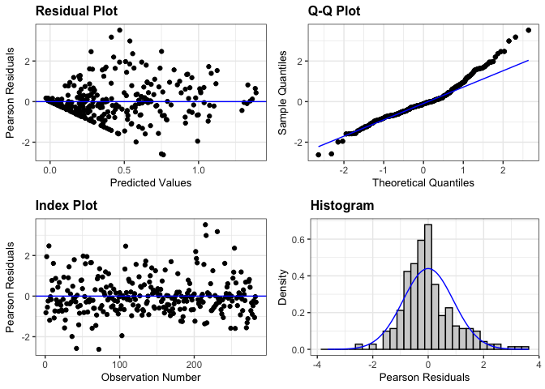<!-- -->

```
## 
## $CHEAL_percent
```

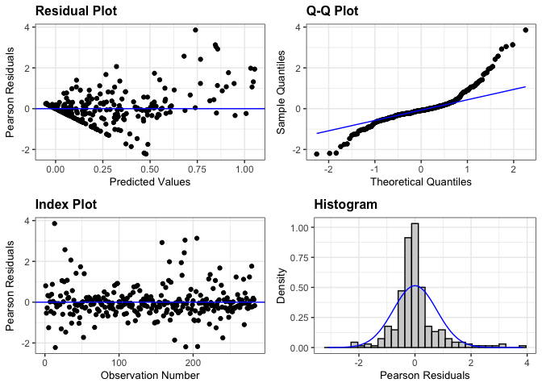<!-- -->

```
## 
## $DIGSA_percent
```

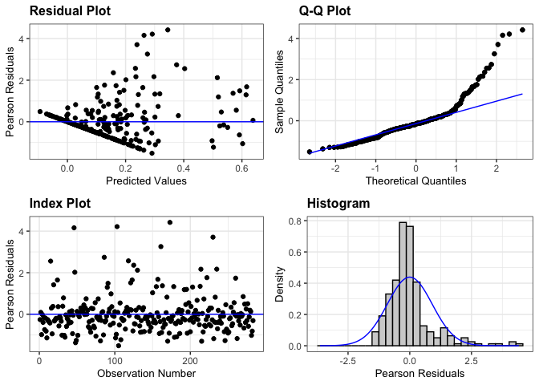<!-- -->

```
## 
## $ECHCG_percent
```

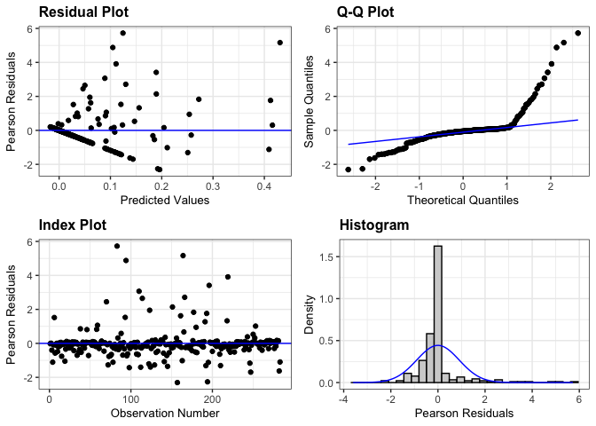<!-- -->

```
## 
## $SETSP_percent
```

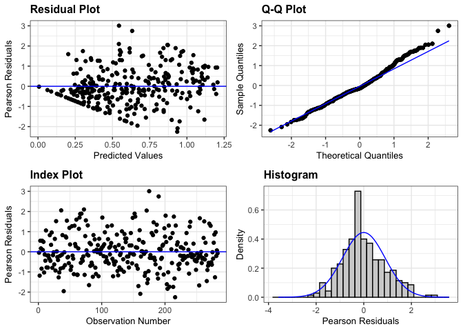<!-- -->

```
## 
## $TAROF_percent
```

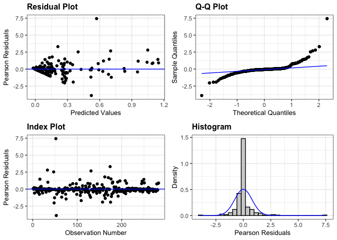<!-- -->


```r
indv_spp_result_t$means %>%
   map(~ broom::tidy(.x)) %>%
 bind_rows(.id = "spp") %>%
  select(1:5) %>%
    mutate(across(where(is.numeric), ~ as.numeric(sprintf('%.2f', .))*100)) %>%
  mutate(Relative.abundance = paste0(response, " (", std.error, ")")) %>%
  select(-c(response, std.error)) %>%
  mutate(spp = substr(spp, 1, 5)) %>%
  pivot_wider(names_from = spp, values_from = Relative.abundance) %>%
    mutate(Crop_ID = factor(Crop_ID, levels = c("C2", "C3", "C4",
                                                "S2", "S3", "S4",
                                                "O3", "O4", "A4"))) %>% # Replace with the specific order of Crop_ID you need
  arrange(Corn_weed_management, Crop_ID) %>%
flextable::flextable()
```

```{=html}
<div class="tabwid"><style>.cl-495f0af8{}.cl-4958936c{font-family:'Helvetica';font-size:11pt;font-weight:normal;font-style:normal;text-decoration:none;color:rgba(0, 0, 0, 1.00);background-color:transparent;}.cl-495b1326{margin:0;text-align:left;border-bottom: 0 solid rgba(0, 0, 0, 1.00);border-top: 0 solid rgba(0, 0, 0, 1.00);border-left: 0 solid rgba(0, 0, 0, 1.00);border-right: 0 solid rgba(0, 0, 0, 1.00);padding-bottom:5pt;padding-top:5pt;padding-left:5pt;padding-right:5pt;line-height: 1;background-color:transparent;}.cl-495b262c{width:0.75in;background-color:transparent;vertical-align: middle;border-bottom: 1.5pt solid rgba(102, 102, 102, 1.00);border-top: 1.5pt solid rgba(102, 102, 102, 1.00);border-left: 0 solid rgba(0, 0, 0, 1.00);border-right: 0 solid rgba(0, 0, 0, 1.00);margin-bottom:0;margin-top:0;margin-left:0;margin-right:0;}.cl-495b2636{width:0.75in;background-color:transparent;vertical-align: middle;border-bottom: 0 solid rgba(0, 0, 0, 1.00);border-top: 0 solid rgba(0, 0, 0, 1.00);border-left: 0 solid rgba(0, 0, 0, 1.00);border-right: 0 solid rgba(0, 0, 0, 1.00);margin-bottom:0;margin-top:0;margin-left:0;margin-right:0;}.cl-495b2640{width:0.75in;background-color:transparent;vertical-align: middle;border-bottom: 1.5pt solid rgba(102, 102, 102, 1.00);border-top: 0 solid rgba(0, 0, 0, 1.00);border-left: 0 solid rgba(0, 0, 0, 1.00);border-right: 0 solid rgba(0, 0, 0, 1.00);margin-bottom:0;margin-top:0;margin-left:0;margin-right:0;}</style><table data-quarto-disable-processing='true' class='cl-495f0af8'><thead><tr style="overflow-wrap:break-word;"><th class="cl-495b262c"><p class="cl-495b1326"><span class="cl-4958936c">Crop_ID</span></p></th><th class="cl-495b262c"><p class="cl-495b1326"><span class="cl-4958936c">Corn_weed_management</span></p></th><th class="cl-495b262c"><p class="cl-495b1326"><span class="cl-4958936c">AMATA</span></p></th><th class="cl-495b262c"><p class="cl-495b1326"><span class="cl-4958936c">CHEAL</span></p></th><th class="cl-495b262c"><p class="cl-495b1326"><span class="cl-4958936c">DIGSA</span></p></th><th class="cl-495b262c"><p class="cl-495b1326"><span class="cl-4958936c">ECHCG</span></p></th><th class="cl-495b262c"><p class="cl-495b1326"><span class="cl-4958936c">SETSP</span></p></th><th class="cl-495b262c"><p class="cl-495b1326"><span class="cl-4958936c">TAROF</span></p></th></tr></thead><tbody><tr style="overflow-wrap:break-word;"><td class="cl-495b2636"><p class="cl-495b1326"><span class="cl-4958936c">C2</span></p></td><td class="cl-495b2636"><p class="cl-495b1326"><span class="cl-4958936c">conv</span></p></td><td class="cl-495b2636"><p class="cl-495b1326"><span class="cl-4958936c">2019 (1371)</span></p></td><td class="cl-495b2636"><p class="cl-495b1326"><span class="cl-4958936c">68 (171)</span></p></td><td class="cl-495b2636"><p class="cl-495b1326"><span class="cl-4958936c">371 (260)</span></p></td><td class="cl-495b2636"><p class="cl-495b1326"><span class="cl-4958936c">3 (14)</span></p></td><td class="cl-495b2636"><p class="cl-495b1326"><span class="cl-4958936c">5965 (1162)</span></p></td><td class="cl-495b2636"><p class="cl-495b1326"><span class="cl-4958936c">1 (14)</span></p></td></tr><tr style="overflow-wrap:break-word;"><td class="cl-495b2636"><p class="cl-495b1326"><span class="cl-4958936c">C3</span></p></td><td class="cl-495b2636"><p class="cl-495b1326"><span class="cl-4958936c">conv</span></p></td><td class="cl-495b2636"><p class="cl-495b1326"><span class="cl-4958936c">1637 (1263)</span></p></td><td class="cl-495b2636"><p class="cl-495b1326"><span class="cl-4958936c">3 (38)</span></p></td><td class="cl-495b2636"><p class="cl-495b1326"><span class="cl-4958936c">536 (310)</span></p></td><td class="cl-495b2636"><p class="cl-495b1326"><span class="cl-4958936c">0 (0)</span></p></td><td class="cl-495b2636"><p class="cl-495b1326"><span class="cl-4958936c">5733 (1171)</span></p></td><td class="cl-495b2636"><p class="cl-495b1326"><span class="cl-4958936c">12 (43)</span></p></td></tr><tr style="overflow-wrap:break-word;"><td class="cl-495b2636"><p class="cl-495b1326"><span class="cl-4958936c">C4</span></p></td><td class="cl-495b2636"><p class="cl-495b1326"><span class="cl-4958936c">conv</span></p></td><td class="cl-495b2636"><p class="cl-495b1326"><span class="cl-4958936c">752 (900)</span></p></td><td class="cl-495b2636"><p class="cl-495b1326"><span class="cl-4958936c">3 (36)</span></p></td><td class="cl-495b2636"><p class="cl-495b1326"><span class="cl-4958936c">376 (262)</span></p></td><td class="cl-495b2636"><p class="cl-495b1326"><span class="cl-4958936c">8 (23)</span></p></td><td class="cl-495b2636"><p class="cl-495b1326"><span class="cl-4958936c">6141 (1153)</span></p></td><td class="cl-495b2636"><p class="cl-495b1326"><span class="cl-4958936c">2 (17)</span></p></td></tr><tr style="overflow-wrap:break-word;"><td class="cl-495b2636"><p class="cl-495b1326"><span class="cl-4958936c">S2</span></p></td><td class="cl-495b2636"><p class="cl-495b1326"><span class="cl-4958936c">conv</span></p></td><td class="cl-495b2636"><p class="cl-495b1326"><span class="cl-4958936c">6029 (1671)</span></p></td><td class="cl-495b2636"><p class="cl-495b1326"><span class="cl-4958936c">879 (588)</span></p></td><td class="cl-495b2636"><p class="cl-495b1326"><span class="cl-4958936c">165 (175)</span></p></td><td class="cl-495b2636"><p class="cl-495b1326"><span class="cl-4958936c">0 (5)</span></p></td><td class="cl-495b2636"><p class="cl-495b1326"><span class="cl-4958936c">468 (500)</span></p></td><td class="cl-495b2636"><p class="cl-495b1326"><span class="cl-4958936c">0 (1)</span></p></td></tr><tr style="overflow-wrap:break-word;"><td class="cl-495b2636"><p class="cl-495b1326"><span class="cl-4958936c">S3</span></p></td><td class="cl-495b2636"><p class="cl-495b1326"><span class="cl-4958936c">conv</span></p></td><td class="cl-495b2636"><p class="cl-495b1326"><span class="cl-4958936c">4232 (1718)</span></p></td><td class="cl-495b2636"><p class="cl-495b1326"><span class="cl-4958936c">397 (420)</span></p></td><td class="cl-495b2636"><p class="cl-495b1326"><span class="cl-4958936c">27 (75)</span></p></td><td class="cl-495b2636"><p class="cl-495b1326"><span class="cl-4958936c">3 (13)</span></p></td><td class="cl-495b2636"><p class="cl-495b1326"><span class="cl-4958936c">2903 (1129)</span></p></td><td class="cl-495b2636"><p class="cl-495b1326"><span class="cl-4958936c">0 (5)</span></p></td></tr><tr style="overflow-wrap:break-word;"><td class="cl-495b2636"><p class="cl-495b1326"><span class="cl-4958936c">S4</span></p></td><td class="cl-495b2636"><p class="cl-495b1326"><span class="cl-4958936c">conv</span></p></td><td class="cl-495b2636"><p class="cl-495b1326"><span class="cl-4958936c">1504 (1229)</span></p></td><td class="cl-495b2636"><p class="cl-495b1326"><span class="cl-4958936c">1583 (770)</span></p></td><td class="cl-495b2636"><p class="cl-495b1326"><span class="cl-4958936c">62 (110)</span></p></td><td class="cl-495b2636"><p class="cl-495b1326"><span class="cl-4958936c">10 (26)</span></p></td><td class="cl-495b2636"><p class="cl-495b1326"><span class="cl-4958936c">836 (670)</span></p></td><td class="cl-495b2636"><p class="cl-495b1326"><span class="cl-4958936c">122 (138)</span></p></td></tr><tr style="overflow-wrap:break-word;"><td class="cl-495b2636"><p class="cl-495b1326"><span class="cl-4958936c">O3</span></p></td><td class="cl-495b2636"><p class="cl-495b1326"><span class="cl-4958936c">conv</span></p></td><td class="cl-495b2636"><p class="cl-495b1326"><span class="cl-4958936c">2102 (1391)</span></p></td><td class="cl-495b2636"><p class="cl-495b1326"><span class="cl-4958936c">3525 (993)</span></p></td><td class="cl-495b2636"><p class="cl-495b1326"><span class="cl-4958936c">125 (153)</span></p></td><td class="cl-495b2636"><p class="cl-495b1326"><span class="cl-4958936c">54 (59)</span></p></td><td class="cl-495b2636"><p class="cl-495b1326"><span class="cl-4958936c">1435 (830)</span></p></td><td class="cl-495b2636"><p class="cl-495b1326"><span class="cl-4958936c">158 (155)</span></p></td></tr><tr style="overflow-wrap:break-word;"><td class="cl-495b2636"><p class="cl-495b1326"><span class="cl-4958936c">O4</span></p></td><td class="cl-495b2636"><p class="cl-495b1326"><span class="cl-4958936c">conv</span></p></td><td class="cl-495b2636"><p class="cl-495b1326"><span class="cl-4958936c">2104 (1392)</span></p></td><td class="cl-495b2636"><p class="cl-495b1326"><span class="cl-4958936c">1850 (807)</span></p></td><td class="cl-495b2636"><p class="cl-495b1326"><span class="cl-4958936c">199 (192)</span></p></td><td class="cl-495b2636"><p class="cl-495b1326"><span class="cl-4958936c">156 (100)</span></p></td><td class="cl-495b2636"><p class="cl-495b1326"><span class="cl-4958936c">3383 (1120)</span></p></td><td class="cl-495b2636"><p class="cl-495b1326"><span class="cl-4958936c">372 (235)</span></p></td></tr><tr style="overflow-wrap:break-word;"><td class="cl-495b2636"><p class="cl-495b1326"><span class="cl-4958936c">A4</span></p></td><td class="cl-495b2636"><p class="cl-495b1326"><span class="cl-4958936c">conv</span></p></td><td class="cl-495b2636"><p class="cl-495b1326"><span class="cl-4958936c">117 (367)</span></p></td><td class="cl-495b2636"><p class="cl-495b1326"><span class="cl-4958936c">257 (329)</span></p></td><td class="cl-495b2636"><p class="cl-495b1326"><span class="cl-4958936c">1698 (517)</span></p></td><td class="cl-495b2636"><p class="cl-495b1326"><span class="cl-4958936c">287 (134)</span></p></td><td class="cl-495b2636"><p class="cl-495b1326"><span class="cl-4958936c">1352 (810)</span></p></td><td class="cl-495b2636"><p class="cl-495b1326"><span class="cl-4958936c">3496 (591)</span></p></td></tr><tr style="overflow-wrap:break-word;"><td class="cl-495b2636"><p class="cl-495b1326"><span class="cl-4958936c">C2</span></p></td><td class="cl-495b2636"><p class="cl-495b1326"><span class="cl-4958936c">low</span></p></td><td class="cl-495b2636"><p class="cl-495b1326"><span class="cl-4958936c">1329 (1159)</span></p></td><td class="cl-495b2636"><p class="cl-495b1326"><span class="cl-4958936c">40 (131)</span></p></td><td class="cl-495b2636"><p class="cl-495b1326"><span class="cl-4958936c">5 (32)</span></p></td><td class="cl-495b2636"><p class="cl-495b1326"><span class="cl-4958936c">0 (0)</span></p></td><td class="cl-495b2636"><p class="cl-495b1326"><span class="cl-4958936c">6712 (1112)</span></p></td><td class="cl-495b2636"><p class="cl-495b1326"><span class="cl-4958936c">2 (18)</span></p></td></tr><tr style="overflow-wrap:break-word;"><td class="cl-495b2636"><p class="cl-495b1326"><span class="cl-4958936c">C3</span></p></td><td class="cl-495b2636"><p class="cl-495b1326"><span class="cl-4958936c">low</span></p></td><td class="cl-495b2636"><p class="cl-495b1326"><span class="cl-4958936c">381 (654)</span></p></td><td class="cl-495b2636"><p class="cl-495b1326"><span class="cl-4958936c">235 (315)</span></p></td><td class="cl-495b2636"><p class="cl-495b1326"><span class="cl-4958936c">2 (18)</span></p></td><td class="cl-495b2636"><p class="cl-495b1326"><span class="cl-4958936c">0 (0)</span></p></td><td class="cl-495b2636"><p class="cl-495b1326"><span class="cl-4958936c">7953 (955)</span></p></td><td class="cl-495b2636"><p class="cl-495b1326"><span class="cl-4958936c">4 (26)</span></p></td></tr><tr style="overflow-wrap:break-word;"><td class="cl-495b2636"><p class="cl-495b1326"><span class="cl-4958936c">C4</span></p></td><td class="cl-495b2636"><p class="cl-495b1326"><span class="cl-4958936c">low</span></p></td><td class="cl-495b2636"><p class="cl-495b1326"><span class="cl-4958936c">666 (851)</span></p></td><td class="cl-495b2636"><p class="cl-495b1326"><span class="cl-4958936c">54 (152)</span></p></td><td class="cl-495b2636"><p class="cl-495b1326"><span class="cl-4958936c">78 (121)</span></p></td><td class="cl-495b2636"><p class="cl-495b1326"><span class="cl-4958936c">0 (0)</span></p></td><td class="cl-495b2636"><p class="cl-495b1326"><span class="cl-4958936c">6112 (1154)</span></p></td><td class="cl-495b2636"><p class="cl-495b1326"><span class="cl-4958936c">22 (57)</span></p></td></tr><tr style="overflow-wrap:break-word;"><td class="cl-495b2636"><p class="cl-495b1326"><span class="cl-4958936c">S2</span></p></td><td class="cl-495b2636"><p class="cl-495b1326"><span class="cl-4958936c">low</span></p></td><td class="cl-495b2636"><p class="cl-495b1326"><span class="cl-4958936c">5398 (1702)</span></p></td><td class="cl-495b2636"><p class="cl-495b1326"><span class="cl-4958936c">836 (575)</span></p></td><td class="cl-495b2636"><p class="cl-495b1326"><span class="cl-4958936c">5 (31)</span></p></td><td class="cl-495b2636"><p class="cl-495b1326"><span class="cl-4958936c">1 (8)</span></p></td><td class="cl-495b2636"><p class="cl-495b1326"><span class="cl-4958936c">1737 (897)</span></p></td><td class="cl-495b2636"><p class="cl-495b1326"><span class="cl-4958936c">0 (3)</span></p></td></tr><tr style="overflow-wrap:break-word;"><td class="cl-495b2636"><p class="cl-495b1326"><span class="cl-4958936c">S3</span></p></td><td class="cl-495b2636"><p class="cl-495b1326"><span class="cl-4958936c">low</span></p></td><td class="cl-495b2636"><p class="cl-495b1326"><span class="cl-4958936c">2623 (1524)</span></p></td><td class="cl-495b2636"><p class="cl-495b1326"><span class="cl-4958936c">1113 (674)</span></p></td><td class="cl-495b2636"><p class="cl-495b1326"><span class="cl-4958936c">14 (54)</span></p></td><td class="cl-495b2636"><p class="cl-495b1326"><span class="cl-4958936c">19 (35)</span></p></td><td class="cl-495b2636"><p class="cl-495b1326"><span class="cl-4958936c">2456 (1065)</span></p></td><td class="cl-495b2636"><p class="cl-495b1326"><span class="cl-4958936c">0 (2)</span></p></td></tr><tr style="overflow-wrap:break-word;"><td class="cl-495b2636"><p class="cl-495b1326"><span class="cl-4958936c">S4</span></p></td><td class="cl-495b2636"><p class="cl-495b1326"><span class="cl-4958936c">low</span></p></td><td class="cl-495b2636"><p class="cl-495b1326"><span class="cl-4958936c">1984 (1362)</span></p></td><td class="cl-495b2636"><p class="cl-495b1326"><span class="cl-4958936c">282 (344)</span></p></td><td class="cl-495b2636"><p class="cl-495b1326"><span class="cl-4958936c">85 (127)</span></p></td><td class="cl-495b2636"><p class="cl-495b1326"><span class="cl-4958936c">0 (0)</span></p></td><td class="cl-495b2636"><p class="cl-495b1326"><span class="cl-4958936c">1850 (919)</span></p></td><td class="cl-495b2636"><p class="cl-495b1326"><span class="cl-4958936c">39 (77)</span></p></td></tr><tr style="overflow-wrap:break-word;"><td class="cl-495b2636"><p class="cl-495b1326"><span class="cl-4958936c">O3</span></p></td><td class="cl-495b2636"><p class="cl-495b1326"><span class="cl-4958936c">low</span></p></td><td class="cl-495b2636"><p class="cl-495b1326"><span class="cl-4958936c">1144 (1087)</span></p></td><td class="cl-495b2636"><p class="cl-495b1326"><span class="cl-4958936c">2777 (931)</span></p></td><td class="cl-495b2636"><p class="cl-495b1326"><span class="cl-4958936c">25 (69)</span></p></td><td class="cl-495b2636"><p class="cl-495b1326"><span class="cl-4958936c">3 (15)</span></p></td><td class="cl-495b2636"><p class="cl-495b1326"><span class="cl-4958936c">3677 (1142)</span></p></td><td class="cl-495b2636"><p class="cl-495b1326"><span class="cl-4958936c">96 (121)</span></p></td></tr><tr style="overflow-wrap:break-word;"><td class="cl-495b2636"><p class="cl-495b1326"><span class="cl-4958936c">O4</span></p></td><td class="cl-495b2636"><p class="cl-495b1326"><span class="cl-4958936c">low</span></p></td><td class="cl-495b2636"><p class="cl-495b1326"><span class="cl-4958936c">1931 (1348)</span></p></td><td class="cl-495b2636"><p class="cl-495b1326"><span class="cl-4958936c">1887 (813)</span></p></td><td class="cl-495b2636"><p class="cl-495b1326"><span class="cl-4958936c">210 (197)</span></p></td><td class="cl-495b2636"><p class="cl-495b1326"><span class="cl-4958936c">38 (49)</span></p></td><td class="cl-495b2636"><p class="cl-495b1326"><span class="cl-4958936c">3733 (1145)</span></p></td><td class="cl-495b2636"><p class="cl-495b1326"><span class="cl-4958936c">382 (237)</span></p></td></tr><tr style="overflow-wrap:break-word;"><td class="cl-495b2640"><p class="cl-495b1326"><span class="cl-4958936c">A4</span></p></td><td class="cl-495b2640"><p class="cl-495b1326"><span class="cl-4958936c">low</span></p></td><td class="cl-495b2640"><p class="cl-495b1326"><span class="cl-4958936c">317 (598)</span></p></td><td class="cl-495b2640"><p class="cl-495b1326"><span class="cl-4958936c">143 (247)</span></p></td><td class="cl-495b2640"><p class="cl-495b1326"><span class="cl-4958936c">1538 (497)</span></p></td><td class="cl-495b2640"><p class="cl-495b1326"><span class="cl-4958936c">52 (58)</span></p></td><td class="cl-495b2640"><p class="cl-495b1326"><span class="cl-4958936c">1593 (867)</span></p></td><td class="cl-495b2640"><p class="cl-495b1326"><span class="cl-4958936c">3557 (593)</span></p></td></tr></tbody></table></div>
```


<table class="table" style="color: black; margin-left: auto; margin-right: auto;border-bottom: 0;">
<caption>(\#tab:indiv-dens-biom-ct)Contrast of stand density and aboveground mass of the seven most abundant weed species. Weed species are listed alphabetically. The abbreviations on the contrast column are crop identities, which are the combinations of the first letter in crop species names and the rotation in which it occurred.</caption>
 <thead>
<tr>
<th style="empty-cells: hide;border-bottom:hidden;" colspan="1"></th>
<th style="border-bottom:hidden;padding-bottom:0; padding-left:3px;padding-right:3px;text-align: center; " colspan="2"><div style="border-bottom: 1px solid #ddd; padding-bottom: 5px; ">AMATA</div></th>
<th style="border-bottom:hidden;padding-bottom:0; padding-left:3px;padding-right:3px;text-align: center; " colspan="2"><div style="border-bottom: 1px solid #ddd; padding-bottom: 5px; ">CHEAL</div></th>
<th style="border-bottom:hidden;padding-bottom:0; padding-left:3px;padding-right:3px;text-align: center; " colspan="2"><div style="border-bottom: 1px solid #ddd; padding-bottom: 5px; ">DIGSA</div></th>
<th style="border-bottom:hidden;padding-bottom:0; padding-left:3px;padding-right:3px;text-align: center; " colspan="2"><div style="border-bottom: 1px solid #ddd; padding-bottom: 5px; ">ECHCG</div></th>
<th style="border-bottom:hidden;padding-bottom:0; padding-left:3px;padding-right:3px;text-align: center; " colspan="2"><div style="border-bottom: 1px solid #ddd; padding-bottom: 5px; ">SETFA</div></th>
<th style="border-bottom:hidden;padding-bottom:0; padding-left:3px;padding-right:3px;text-align: center; " colspan="2"><div style="border-bottom: 1px solid #ddd; padding-bottom: 5px; ">SETLU</div></th>
<th style="border-bottom:hidden;padding-bottom:0; padding-left:3px;padding-right:3px;text-align: center; " colspan="2"><div style="border-bottom: 1px solid #ddd; padding-bottom: 5px; ">TAROF</div></th>
</tr>
  <tr>
   <th style="text-align:left;"> Contrast of the main-plot effect </th>
   <th style="text-align:right;"> ratio </th>
   <th style="text-align:right;"> p </th>
   <th style="text-align:right;"> ratio </th>
   <th style="text-align:right;"> p </th>
   <th style="text-align:right;"> ratio </th>
   <th style="text-align:right;"> p </th>
   <th style="text-align:right;"> ratio </th>
   <th style="text-align:right;"> p </th>
   <th style="text-align:right;"> ratio </th>
   <th style="text-align:right;"> p </th>
   <th style="text-align:right;"> ratio </th>
   <th style="text-align:right;"> p </th>
   <th style="text-align:right;"> ratio </th>
   <th style="text-align:right;"> p </th>
  </tr>
 </thead>
<tbody>
  <tr grouplength="13"><td colspan="15" style="border-bottom: 1px solid;"><strong>(A) - Stand density</strong></td></tr>
<tr grouplength="4"><td colspan="15" style="border-bottom: 1px solid;"><strong>(A1) - Rotation system effects</strong></td></tr>
<tr>
   <td style="text-align:left;padding-left: 4em;" indentlevel="2"> [(C2+S2)/2] vs [(C3+S3+O3+C4+S4+O4+A4)/7] </td>
   <td style="text-align:right;"> -0.31 </td>
   <td style="text-align:right;border-right:1px solid;"> 0.6105 </td>
   <td style="text-align:right;"> -1.29 </td>
   <td style="text-align:right;border-right:1px solid;"> 0.0008 </td>
   <td style="text-align:right;"> -0.88 </td>
   <td style="text-align:right;border-right:1px solid;"> 0.0072 </td>
   <td style="text-align:right;"> -0.57 </td>
   <td style="text-align:right;border-right:1px solid;"> 0.1170 </td>
   <td style="text-align:right;"> -0.45 </td>
   <td style="text-align:right;border-right:1px solid;"> 0.3011 </td>
   <td style="text-align:right;"> -0.70 </td>
   <td style="text-align:right;border-right:1px solid;"> 0.1569 </td>
   <td style="text-align:right;"> -1.41 </td>
   <td style="text-align:right;"> &lt;.0001 </td>
  </tr>
  <tr>
   <td style="text-align:left;padding-left: 4em;" indentlevel="2"> [(C3+S3+O3)/3] vs [(C4+S4+O4+A4)/4] </td>
   <td style="text-align:right;"> -0.21 </td>
   <td style="text-align:right;border-right:1px solid;"> 0.7077 </td>
   <td style="text-align:right;"> -0.03 </td>
   <td style="text-align:right;border-right:1px solid;"> 0.9195 </td>
   <td style="text-align:right;"> -1.58 </td>
   <td style="text-align:right;border-right:1px solid;"> &lt;.0001 </td>
   <td style="text-align:right;"> -0.60 </td>
   <td style="text-align:right;border-right:1px solid;"> 0.0834 </td>
   <td style="text-align:right;"> -0.71 </td>
   <td style="text-align:right;border-right:1px solid;"> 0.0927 </td>
   <td style="text-align:right;"> -0.82 </td>
   <td style="text-align:right;border-right:1px solid;"> 0.0827 </td>
   <td style="text-align:right;"> -1.67 </td>
   <td style="text-align:right;"> &lt;.0001 </td>
  </tr>
  <tr>
   <td style="text-align:left;padding-left: 4em;" indentlevel="2"> [(C2+S2)/2] vs [(C3+S3+C4+S4)/4] </td>
   <td style="text-align:right;"> 0.90 </td>
   <td style="text-align:right;border-right:1px solid;"> 0.1746 </td>
   <td style="text-align:right;"> 0.32 </td>
   <td style="text-align:right;border-right:1px solid;"> 0.3889 </td>
   <td style="text-align:right;"> 0.13 </td>
   <td style="text-align:right;border-right:1px solid;"> 0.6798 </td>
   <td style="text-align:right;"> -0.02 </td>
   <td style="text-align:right;border-right:1px solid;"> 0.9584 </td>
   <td style="text-align:right;"> 0.62 </td>
   <td style="text-align:right;border-right:1px solid;"> 0.1906 </td>
   <td style="text-align:right;"> -0.36 </td>
   <td style="text-align:right;border-right:1px solid;"> 0.4944 </td>
   <td style="text-align:right;"> -0.05 </td>
   <td style="text-align:right;"> 0.8129 </td>
  </tr>
  <tr>
   <td style="text-align:left;padding-left: 4em;" indentlevel="2"> [(C3+S3)/2] vs [(C4+S4)/2] </td>
   <td style="text-align:right;"> 0.56 </td>
   <td style="text-align:right;border-right:1px solid;"> 0.4533 </td>
   <td style="text-align:right;"> 0.37 </td>
   <td style="text-align:right;border-right:1px solid;"> 0.3823 </td>
   <td style="text-align:right;"> -0.38 </td>
   <td style="text-align:right;border-right:1px solid;"> 0.3213 </td>
   <td style="text-align:right;"> -0.03 </td>
   <td style="text-align:right;border-right:1px solid;"> 0.9384 </td>
   <td style="text-align:right;"> -0.29 </td>
   <td style="text-align:right;border-right:1px solid;"> 0.5877 </td>
   <td style="text-align:right;"> -0.30 </td>
   <td style="text-align:right;border-right:1px solid;"> 0.6234 </td>
   <td style="text-align:right;"> -0.17 </td>
   <td style="text-align:right;"> 0.5105 </td>
  </tr>
  <tr grouplength="5"><td colspan="15" style="border-bottom: 1px solid;"><strong>(A2) - Rotation system effects within individual crops</strong></td></tr>
<tr>
   <td style="text-align:left;padding-left: 4em;" indentlevel="2"> C2 vs [(C3+C4)/2] </td>
   <td style="text-align:right;"> 0.85 </td>
   <td style="text-align:right;border-right:1px solid;"> 0.3598 </td>
   <td style="text-align:right;"> 0.35 </td>
   <td style="text-align:right;border-right:1px solid;"> 0.4995 </td>
   <td style="text-align:right;"> -0.07 </td>
   <td style="text-align:right;border-right:1px solid;"> 0.8818 </td>
   <td style="text-align:right;"> -0.03 </td>
   <td style="text-align:right;border-right:1px solid;"> 0.9497 </td>
   <td style="text-align:right;"> 0.44 </td>
   <td style="text-align:right;border-right:1px solid;"> 0.5010 </td>
   <td style="text-align:right;"> -0.59 </td>
   <td style="text-align:right;border-right:1px solid;"> 0.4277 </td>
   <td style="text-align:right;"> 0.02 </td>
   <td style="text-align:right;"> 0.9547 </td>
  </tr>
  <tr>
   <td style="text-align:left;padding-left: 4em;" indentlevel="2"> C3 vs C4 </td>
   <td style="text-align:right;"> 0.50 </td>
   <td style="text-align:right;border-right:1px solid;"> 0.6368 </td>
   <td style="text-align:right;"> 0.27 </td>
   <td style="text-align:right;border-right:1px solid;"> 0.6510 </td>
   <td style="text-align:right;"> -0.62 </td>
   <td style="text-align:right;border-right:1px solid;"> 0.2466 </td>
   <td style="text-align:right;"> -0.11 </td>
   <td style="text-align:right;border-right:1px solid;"> 0.8579 </td>
   <td style="text-align:right;"> -0.72 </td>
   <td style="text-align:right;border-right:1px solid;"> 0.3501 </td>
   <td style="text-align:right;"> -0.72 </td>
   <td style="text-align:right;border-right:1px solid;"> 0.3990 </td>
   <td style="text-align:right;"> -0.14 </td>
   <td style="text-align:right;"> 0.6923 </td>
  </tr>
  <tr>
   <td style="text-align:left;padding-left: 4em;" indentlevel="2"> S2 vs [(S3+S4)/2] </td>
   <td style="text-align:right;"> 0.95 </td>
   <td style="text-align:right;border-right:1px solid;"> 0.3065 </td>
   <td style="text-align:right;"> 0.28 </td>
   <td style="text-align:right;border-right:1px solid;"> 0.5837 </td>
   <td style="text-align:right;"> 0.34 </td>
   <td style="text-align:right;border-right:1px solid;"> 0.4658 </td>
   <td style="text-align:right;"> -0.01 </td>
   <td style="text-align:right;border-right:1px solid;"> 0.9915 </td>
   <td style="text-align:right;"> 0.79 </td>
   <td style="text-align:right;border-right:1px solid;"> 0.2337 </td>
   <td style="text-align:right;"> -0.13 </td>
   <td style="text-align:right;border-right:1px solid;"> 0.8628 </td>
   <td style="text-align:right;"> -0.12 </td>
   <td style="text-align:right;"> 0.6958 </td>
  </tr>
  <tr>
   <td style="text-align:left;padding-left: 4em;" indentlevel="2"> S3 vs S4 </td>
   <td style="text-align:right;"> 0.63 </td>
   <td style="text-align:right;border-right:1px solid;"> 0.5543 </td>
   <td style="text-align:right;"> 0.47 </td>
   <td style="text-align:right;border-right:1px solid;"> 0.4312 </td>
   <td style="text-align:right;"> -0.13 </td>
   <td style="text-align:right;border-right:1px solid;"> 0.8088 </td>
   <td style="text-align:right;"> 0.04 </td>
   <td style="text-align:right;border-right:1px solid;"> 0.9444 </td>
   <td style="text-align:right;"> 0.13 </td>
   <td style="text-align:right;border-right:1px solid;"> 0.8620 </td>
   <td style="text-align:right;"> 0.13 </td>
   <td style="text-align:right;border-right:1px solid;"> 0.8780 </td>
   <td style="text-align:right;"> -0.19 </td>
   <td style="text-align:right;"> 0.5914 </td>
  </tr>
  <tr>
   <td style="text-align:left;padding-left: 4em;" indentlevel="2"> O3 vs O4 </td>
   <td style="text-align:right;"> -1.13 </td>
   <td style="text-align:right;border-right:1px solid;"> 0.2890 </td>
   <td style="text-align:right;"> -0.29 </td>
   <td style="text-align:right;border-right:1px solid;"> 0.6212 </td>
   <td style="text-align:right;"> -1.58 </td>
   <td style="text-align:right;border-right:1px solid;"> 0.0062 </td>
   <td style="text-align:right;"> -0.79 </td>
   <td style="text-align:right;border-right:1px solid;"> 0.2130 </td>
   <td style="text-align:right;"> -0.53 </td>
   <td style="text-align:right;border-right:1px solid;"> 0.4848 </td>
   <td style="text-align:right;"> -1.10 </td>
   <td style="text-align:right;border-right:1px solid;"> 0.2006 </td>
   <td style="text-align:right;"> -2.40 </td>
   <td style="text-align:right;"> &lt;.0001 </td>
  </tr>
  <tr grouplength="4"><td colspan="15" style="border-bottom: 1px solid;"><strong>(A3) - Crop type effects</strong></td></tr>
<tr>
   <td style="text-align:left;padding-left: 4em;" indentlevel="2"> [(O3+O4+A4)/3] vs [(C2+S2+C3+S3+C4+S4)/6] </td>
   <td style="text-align:right;"> 2.51 </td>
   <td style="text-align:right;border-right:1px solid;"> 0.0001 </td>
   <td style="text-align:right;"> 3.64 </td>
   <td style="text-align:right;border-right:1px solid;"> &lt;.0001 </td>
   <td style="text-align:right;"> 2.31 </td>
   <td style="text-align:right;border-right:1px solid;"> &lt;.0001 </td>
   <td style="text-align:right;"> 1.28 </td>
   <td style="text-align:right;border-right:1px solid;"> 0.0003 </td>
   <td style="text-align:right;"> 2.29 </td>
   <td style="text-align:right;border-right:1px solid;"> &lt;.0001 </td>
   <td style="text-align:right;"> 0.91 </td>
   <td style="text-align:right;border-right:1px solid;"> 0.0404 </td>
   <td style="text-align:right;"> 3.19 </td>
   <td style="text-align:right;"> &lt;.0001 </td>
  </tr>
  <tr>
   <td style="text-align:left;padding-left: 4em;" indentlevel="2"> O3 vs [(C3+S3)/2] </td>
   <td style="text-align:right;"> 2.39 </td>
   <td style="text-align:right;border-right:1px solid;"> 0.0143 </td>
   <td style="text-align:right;"> 4.21 </td>
   <td style="text-align:right;border-right:1px solid;"> &lt;.0001 </td>
   <td style="text-align:right;"> 0.89 </td>
   <td style="text-align:right;border-right:1px solid;"> 0.0631 </td>
   <td style="text-align:right;"> 0.66 </td>
   <td style="text-align:right;border-right:1px solid;"> 0.2248 </td>
   <td style="text-align:right;"> 2.43 </td>
   <td style="text-align:right;border-right:1px solid;"> 0.0010 </td>
   <td style="text-align:right;"> 0.05 </td>
   <td style="text-align:right;border-right:1px solid;"> 0.9435 </td>
   <td style="text-align:right;"> 1.47 </td>
   <td style="text-align:right;"> 0.0001 </td>
  </tr>
  <tr>
   <td style="text-align:left;padding-left: 4em;" indentlevel="2"> [(O4+A4)/2] vs [(C4+S4)/2] </td>
   <td style="text-align:right;"> 3.15 </td>
   <td style="text-align:right;border-right:1px solid;"> 0.0003 </td>
   <td style="text-align:right;"> 3.61 </td>
   <td style="text-align:right;border-right:1px solid;"> &lt;.0001 </td>
   <td style="text-align:right;"> 3.00 </td>
   <td style="text-align:right;border-right:1px solid;"> &lt;.0001 </td>
   <td style="text-align:right;"> 1.57 </td>
   <td style="text-align:right;border-right:1px solid;"> 0.0014 </td>
   <td style="text-align:right;"> 2.45 </td>
   <td style="text-align:right;border-right:1px solid;"> 0.0001 </td>
   <td style="text-align:right;"> 1.09 </td>
   <td style="text-align:right;border-right:1px solid;"> 0.0798 </td>
   <td style="text-align:right;"> 3.99 </td>
   <td style="text-align:right;"> &lt;.0001 </td>
  </tr>
  <tr>
   <td style="text-align:left;padding-left: 4em;" indentlevel="2"> [(O3+O4)/2] vs A4 </td>
   <td style="text-align:right;"> 1.31 </td>
   <td style="text-align:right;border-right:1px solid;"> 0.1606 </td>
   <td style="text-align:right;"> 2.37 </td>
   <td style="text-align:right;border-right:1px solid;"> 0.0001 </td>
   <td style="text-align:right;"> -2.61 </td>
   <td style="text-align:right;border-right:1px solid;"> &lt;.0001 </td>
   <td style="text-align:right;"> -0.71 </td>
   <td style="text-align:right;border-right:1px solid;"> 0.1954 </td>
   <td style="text-align:right;"> 0.16 </td>
   <td style="text-align:right;border-right:1px solid;"> 0.8068 </td>
   <td style="text-align:right;"> -1.00 </td>
   <td style="text-align:right;border-right:1px solid;"> 0.1812 </td>
   <td style="text-align:right;"> -1.77 </td>
   <td style="text-align:right;"> &lt;.0001 </td>
  </tr>
  <tr grouplength="13"><td colspan="15" style="border-bottom: 1px solid;"><strong>(B) - Aboveground mass</strong></td></tr>
<tr grouplength="4"><td colspan="15" style="border-bottom: 1px solid;"><strong>(B1) - Rotation system effects</strong></td></tr>
<tr>
   <td style="text-align:left;padding-left: 4em;" indentlevel="2"> [(C2+S2)/2] vs [(C3+S3+O3+C4+S4+O4+A4)/7] </td>
   <td style="text-align:right;"> 1.13 </td>
   <td style="text-align:right;border-right:1px solid;"> 0.3402 </td>
   <td style="text-align:right;"> -1.57 </td>
   <td style="text-align:right;border-right:1px solid;"> 0.0199 </td>
   <td style="text-align:right;"> -1.02 </td>
   <td style="text-align:right;border-right:1px solid;"> 0.1098 </td>
   <td style="text-align:right;"> -1.06 </td>
   <td style="text-align:right;border-right:1px solid;"> 0.1417 </td>
   <td style="text-align:right;"> -0.08 </td>
   <td style="text-align:right;border-right:1px solid;"> 0.9245 </td>
   <td style="text-align:right;"> -0.77 </td>
   <td style="text-align:right;border-right:1px solid;"> 0.3588 </td>
   <td style="text-align:right;"> -2.68 </td>
   <td style="text-align:right;"> &lt;.0001 </td>
  </tr>
  <tr>
   <td style="text-align:left;padding-left: 4em;" indentlevel="2"> [(C3+S3+O3)/3] vs [(C4+S4+O4+A4)/4] </td>
   <td style="text-align:right;"> 0.26 </td>
   <td style="text-align:right;border-right:1px solid;"> 0.8168 </td>
   <td style="text-align:right;"> 0.28 </td>
   <td style="text-align:right;border-right:1px solid;"> 0.6414 </td>
   <td style="text-align:right;"> -2.66 </td>
   <td style="text-align:right;border-right:1px solid;"> 0.0001 </td>
   <td style="text-align:right;"> -1.13 </td>
   <td style="text-align:right;border-right:1px solid;"> 0.1040 </td>
   <td style="text-align:right;"> -0.59 </td>
   <td style="text-align:right;border-right:1px solid;"> 0.4497 </td>
   <td style="text-align:right;"> -0.94 </td>
   <td style="text-align:right;border-right:1px solid;"> 0.2420 </td>
   <td style="text-align:right;"> -3.06 </td>
   <td style="text-align:right;"> &lt;.0001 </td>
  </tr>
  <tr>
   <td style="text-align:left;padding-left: 4em;" indentlevel="2"> [(C2+S2)/2] vs [(C3+S3+C4+S4)/4] </td>
   <td style="text-align:right;"> 2.23 </td>
   <td style="text-align:right;border-right:1px solid;"> 0.0893 </td>
   <td style="text-align:right;"> 0.83 </td>
   <td style="text-align:right;border-right:1px solid;"> 0.2315 </td>
   <td style="text-align:right;"> 0.47 </td>
   <td style="text-align:right;border-right:1px solid;"> 0.4852 </td>
   <td style="text-align:right;"> -0.11 </td>
   <td style="text-align:right;border-right:1px solid;"> 0.8841 </td>
   <td style="text-align:right;"> 1.26 </td>
   <td style="text-align:right;border-right:1px solid;"> 0.1566 </td>
   <td style="text-align:right;"> -0.54 </td>
   <td style="text-align:right;border-right:1px solid;"> 0.5502 </td>
   <td style="text-align:right;"> -0.15 </td>
   <td style="text-align:right;"> 0.7608 </td>
  </tr>
  <tr>
   <td style="text-align:left;padding-left: 4em;" indentlevel="2"> [(C3+S3)/2] vs [(C4+S4)/2] </td>
   <td style="text-align:right;"> 1.04 </td>
   <td style="text-align:right;border-right:1px solid;"> 0.4799 </td>
   <td style="text-align:right;"> 0.89 </td>
   <td style="text-align:right;border-right:1px solid;"> 0.2676 </td>
   <td style="text-align:right;"> -0.62 </td>
   <td style="text-align:right;border-right:1px solid;"> 0.4264 </td>
   <td style="text-align:right;"> -0.00 </td>
   <td style="text-align:right;border-right:1px solid;"> 0.9958 </td>
   <td style="text-align:right;"> -0.06 </td>
   <td style="text-align:right;border-right:1px solid;"> 0.9537 </td>
   <td style="text-align:right;"> -0.11 </td>
   <td style="text-align:right;border-right:1px solid;"> 0.9148 </td>
   <td style="text-align:right;"> -0.39 </td>
   <td style="text-align:right;"> 0.4810 </td>
  </tr>
  <tr grouplength="5"><td colspan="15" style="border-bottom: 1px solid;"><strong>(B2) - Rotation system effects within individual crops</strong></td></tr>
<tr>
   <td style="text-align:left;padding-left: 4em;" indentlevel="2"> C2 vs [(C3+C4)/2] </td>
   <td style="text-align:right;"> 2.01 </td>
   <td style="text-align:right;border-right:1px solid;"> 0.2696 </td>
   <td style="text-align:right;"> 0.79 </td>
   <td style="text-align:right;border-right:1px solid;"> 0.4167 </td>
   <td style="text-align:right;"> 0.06 </td>
   <td style="text-align:right;border-right:1px solid;"> 0.9499 </td>
   <td style="text-align:right;"> 0.02 </td>
   <td style="text-align:right;border-right:1px solid;"> 0.9882 </td>
   <td style="text-align:right;"> 1.03 </td>
   <td style="text-align:right;border-right:1px solid;"> 0.4070 </td>
   <td style="text-align:right;"> -0.73 </td>
   <td style="text-align:right;border-right:1px solid;"> 0.5668 </td>
   <td style="text-align:right;"> -0.07 </td>
   <td style="text-align:right;"> 0.9237 </td>
  </tr>
  <tr>
   <td style="text-align:left;padding-left: 4em;" indentlevel="2"> C3 vs C4 </td>
   <td style="text-align:right;"> 0.58 </td>
   <td style="text-align:right;border-right:1px solid;"> 0.7802 </td>
   <td style="text-align:right;"> 0.53 </td>
   <td style="text-align:right;border-right:1px solid;"> 0.6372 </td>
   <td style="text-align:right;"> -0.93 </td>
   <td style="text-align:right;border-right:1px solid;"> 0.3994 </td>
   <td style="text-align:right;"> -0.38 </td>
   <td style="text-align:right;border-right:1px solid;"> 0.7630 </td>
   <td style="text-align:right;"> -0.94 </td>
   <td style="text-align:right;border-right:1px solid;"> 0.5131 </td>
   <td style="text-align:right;"> -0.69 </td>
   <td style="text-align:right;border-right:1px solid;"> 0.6404 </td>
   <td style="text-align:right;"> -0.17 </td>
   <td style="text-align:right;"> 0.8309 </td>
  </tr>
  <tr>
   <td style="text-align:left;padding-left: 4em;" indentlevel="2"> S2 vs [(S3+S4)/2] </td>
   <td style="text-align:right;"> 2.44 </td>
   <td style="text-align:right;border-right:1px solid;"> 0.1821 </td>
   <td style="text-align:right;"> 0.87 </td>
   <td style="text-align:right;border-right:1px solid;"> 0.3720 </td>
   <td style="text-align:right;"> 0.88 </td>
   <td style="text-align:right;border-right:1px solid;"> 0.3571 </td>
   <td style="text-align:right;"> -0.24 </td>
   <td style="text-align:right;border-right:1px solid;"> 0.8252 </td>
   <td style="text-align:right;"> 1.50 </td>
   <td style="text-align:right;border-right:1px solid;"> 0.2329 </td>
   <td style="text-align:right;"> -0.35 </td>
   <td style="text-align:right;border-right:1px solid;"> 0.7847 </td>
   <td style="text-align:right;"> -0.23 </td>
   <td style="text-align:right;"> 0.7378 </td>
  </tr>
  <tr>
   <td style="text-align:left;padding-left: 4em;" indentlevel="2"> S3 vs S4 </td>
   <td style="text-align:right;"> 1.50 </td>
   <td style="text-align:right;border-right:1px solid;"> 0.4709 </td>
   <td style="text-align:right;"> 1.25 </td>
   <td style="text-align:right;border-right:1px solid;"> 0.2708 </td>
   <td style="text-align:right;"> -0.31 </td>
   <td style="text-align:right;border-right:1px solid;"> 0.7772 </td>
   <td style="text-align:right;"> 0.37 </td>
   <td style="text-align:right;border-right:1px solid;"> 0.7687 </td>
   <td style="text-align:right;"> 0.82 </td>
   <td style="text-align:right;border-right:1px solid;"> 0.5667 </td>
   <td style="text-align:right;"> 0.47 </td>
   <td style="text-align:right;border-right:1px solid;"> 0.7516 </td>
   <td style="text-align:right;"> -0.62 </td>
   <td style="text-align:right;"> 0.4336 </td>
  </tr>
  <tr>
   <td style="text-align:left;padding-left: 4em;" indentlevel="2"> O3 vs O4 </td>
   <td style="text-align:right;"> -1.96 </td>
   <td style="text-align:right;border-right:1px solid;"> 0.3486 </td>
   <td style="text-align:right;"> -0.64 </td>
   <td style="text-align:right;border-right:1px solid;"> 0.5666 </td>
   <td style="text-align:right;"> -3.53 </td>
   <td style="text-align:right;border-right:1px solid;"> 0.0032 </td>
   <td style="text-align:right;"> -2.28 </td>
   <td style="text-align:right;border-right:1px solid;"> 0.0768 </td>
   <td style="text-align:right;"> -1.23 </td>
   <td style="text-align:right;border-right:1px solid;"> 0.3941 </td>
   <td style="text-align:right;"> -2.14 </td>
   <td style="text-align:right;border-right:1px solid;"> 0.1539 </td>
   <td style="text-align:right;"> -4.30 </td>
   <td style="text-align:right;"> &lt;.0001 </td>
  </tr>
  <tr grouplength="4"><td colspan="15" style="border-bottom: 1px solid;"><strong>(B3) - Crop type effects</strong></td></tr>
<tr>
   <td style="text-align:left;padding-left: 4em;" indentlevel="2"> [(O3+O4+A4)/3] vs [(C2+S2+C3+S3+C4+S4)/6] </td>
   <td style="text-align:right;"> 1.81 </td>
   <td style="text-align:right;border-right:1px solid;"> 0.0906 </td>
   <td style="text-align:right;"> 5.32 </td>
   <td style="text-align:right;border-right:1px solid;"> &lt;.0001 </td>
   <td style="text-align:right;"> 3.31 </td>
   <td style="text-align:right;border-right:1px solid;"> &lt;.0001 </td>
   <td style="text-align:right;"> 2.26 </td>
   <td style="text-align:right;border-right:1px solid;"> 0.0012 </td>
   <td style="text-align:right;"> 2.71 </td>
   <td style="text-align:right;border-right:1px solid;"> 0.0008 </td>
   <td style="text-align:right;"> 0.72 </td>
   <td style="text-align:right;border-right:1px solid;"> 0.3316 </td>
   <td style="text-align:right;"> 5.97 </td>
   <td style="text-align:right;"> &lt;.0001 </td>
  </tr>
  <tr>
   <td style="text-align:left;padding-left: 4em;" indentlevel="2"> O3 vs [(C3+S3)/2] </td>
   <td style="text-align:right;"> 2.16 </td>
   <td style="text-align:right;border-right:1px solid;"> 0.2355 </td>
   <td style="text-align:right;"> 6.35 </td>
   <td style="text-align:right;border-right:1px solid;"> &lt;.0001 </td>
   <td style="text-align:right;"> 0.81 </td>
   <td style="text-align:right;border-right:1px solid;"> 0.3924 </td>
   <td style="text-align:right;"> 0.93 </td>
   <td style="text-align:right;border-right:1px solid;"> 0.3920 </td>
   <td style="text-align:right;"> 3.11 </td>
   <td style="text-align:right;border-right:1px solid;"> 0.0180 </td>
   <td style="text-align:right;"> -0.75 </td>
   <td style="text-align:right;border-right:1px solid;"> 0.5554 </td>
   <td style="text-align:right;"> 2.95 </td>
   <td style="text-align:right;"> 0.0002 </td>
  </tr>
  <tr>
   <td style="text-align:left;padding-left: 4em;" indentlevel="2"> [(O4+A4)/2] vs [(C4+S4)/2] </td>
   <td style="text-align:right;"> 3.01 </td>
   <td style="text-align:right;border-right:1px solid;"> 0.0493 </td>
   <td style="text-align:right;"> 5.45 </td>
   <td style="text-align:right;border-right:1px solid;"> &lt;.0001 </td>
   <td style="text-align:right;"> 4.63 </td>
   <td style="text-align:right;border-right:1px solid;"> &lt;.0001 </td>
   <td style="text-align:right;"> 2.86 </td>
   <td style="text-align:right;border-right:1px solid;"> 0.0031 </td>
   <td style="text-align:right;"> 3.13 </td>
   <td style="text-align:right;border-right:1px solid;"> 0.0045 </td>
   <td style="text-align:right;"> 1.16 </td>
   <td style="text-align:right;border-right:1px solid;"> 0.2706 </td>
   <td style="text-align:right;"> 7.30 </td>
   <td style="text-align:right;"> &lt;.0001 </td>
  </tr>
  <tr>
   <td style="text-align:left;padding-left: 4em;" indentlevel="2"> [(O3+O4)/2] vs A4 </td>
   <td style="text-align:right;"> 3.34 </td>
   <td style="text-align:right;border-right:1px solid;"> 0.0724 </td>
   <td style="text-align:right;"> 4.55 </td>
   <td style="text-align:right;border-right:1px solid;"> 0.0001 </td>
   <td style="text-align:right;"> -3.58 </td>
   <td style="text-align:right;border-right:1px solid;"> 0.0008 </td>
   <td style="text-align:right;"> -0.45 </td>
   <td style="text-align:right;border-right:1px solid;"> 0.6762 </td>
   <td style="text-align:right;"> 1.68 </td>
   <td style="text-align:right;border-right:1px solid;"> 0.1818 </td>
   <td style="text-align:right;"> -0.83 </td>
   <td style="text-align:right;border-right:1px solid;"> 0.5132 </td>
   <td style="text-align:right;"> -3.05 </td>
   <td style="text-align:right;"> 0.0001 </td>
  </tr>
</tbody>
<tfoot><tr><td style="padding: 0; " colspan="100%">
<span style="font-style: italic;">Note: </span> <sup></sup> C2 - corn in the 2-year rotation, C3 - corn in the 3-year rotation, C4 - corn in the 4-year rotation, S2 - soybean in the 2-year rotation, S3 - soybean in the 3-year rotation, S4 - soybean in the 4-year rotation, O3 - oat in the 3-year rotation, O4 - oat in the 4-year rotation, and A4 - alfalfa in the 4-year rotation.</td></tr></tfoot>
</table>


